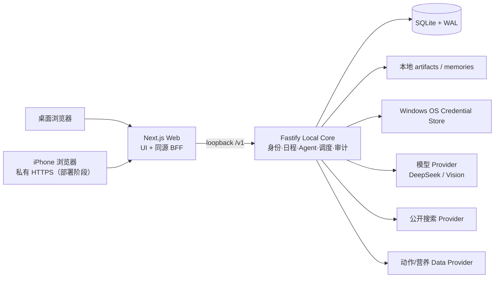
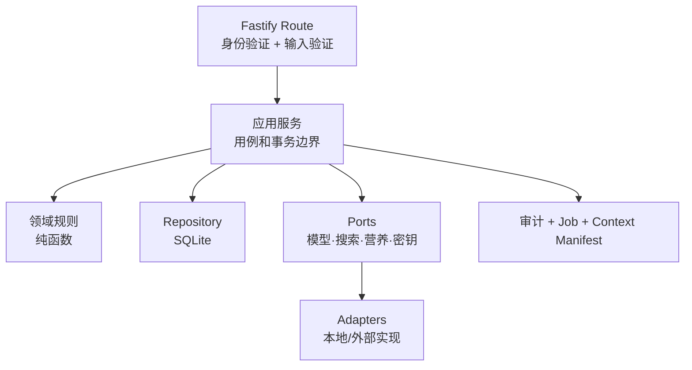
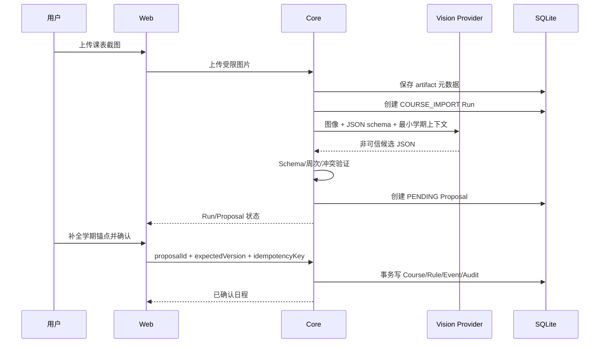
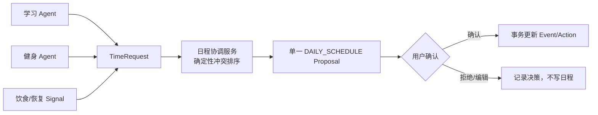
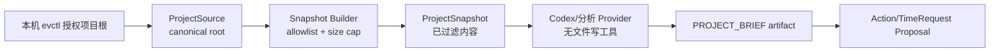

# EV AI Dashboard 系统架构（ARCHITECTURE）

> 本轮范围更新：按[PRD](PRD.md)最新修订，手机端退出MVP，现有Core/Web/SQLite与电脑浏览器入口保留；下文手机/物理Safari/手机私网设计为历史范围，不再作为本轮交付门禁。

> 2026-09-16 用户批准退役项目分析、项目会话和专属 Codex 接入。当前目标保留普通工作待办、学习/生活领域及共享记忆/协调。下文 V8 项目落点及 §5.3 是历史架构，不再是运行或开发入口；历史迁移/数据兼容不等于保留分析功能。范围见 [PRD](PRD.md)，退役技术契约见 [TECH_SPEC](TECH_SPEC.md) 顶部。

> 权威正文迁移（2026-09-08）：原批准/审核记录与目标蓝图保留，不代表当前实现或发布通过。唯一进度见 [TASKS](../plans/TASKS.md)，现有接口见 [API](API.md)，运行见 [DEPLOYMENT](DEPLOYMENT.md)。V8 增量以 [TECH_SPEC 第 12 节](TECH_SPEC.md#12-v8-增量设计冻结) 为准；旧蓝图中的未实现命令、端点与目录均为设计待核验，不能作为可调用说明。

> 实施状态说明（2026-08-17）：本文描述已批准的目标架构，其中包含尚未交付的 Provider、RAG、视觉识别和远程访问设计。当前 MVP 的实际结构、接口和限制见[本地 MVP 技术设计](technical/IMPLEMENTED-MVP-DESIGN.md)。

| 字段 | 内容 |
| --- | --- |
| 版本 | 0.1 |
| 状态 | 技术设计草案，待审核 |
| 日期 | 2026-08-17 |
| 上游依据 | [PRD](PRD.md)、[MVP 范围](product/MVP-SCOPE.md)、[技术规格](TECH_SPEC.md) |
| 架构风格 | 本地优先的模块化单体 Core + Web BFF；Provider 与数据源采用 Ports/Adapters |

## V8 历史落点（项目链已取消，记忆与协调保留）

Frontend = `apps/web`，backend = `apps/core`；目录收口只迁文档，不物理重排业务。下文保留原目标蓝图；尚不存在的模块/命令/目录不是搭空壳的任务。实际日计划实现位于 `modules/daily-planning`，不要照旧树新建一套 day-planning 协调器。

| 扩展落点 | 数据流与权限边界 |
| --- | --- |
| Core 本机 CLI → project scope-service | 显式目录授权仅写 EV 自己的数据库；浏览器不能获得路径管理能力 |
| projects snapshot → analyzer port → 项目建议 | analyzer 只接收过滤后的文档值与依据，不持有路径、shell、Git或写入工具；来源文本不具有指令权限 |
| Owner 确认 → 既有 Action/TimeRequest | 项目行动进入既有领域链；确认前无行动请求，分析产物不写回被分析目录 |
| memory service → revision / projection / compaction draft | Owner+实体隔离；草案、有效内容与历史分离，确认/恢复追加版本，永久删除优先 |
| daily-planning context / repository / review-service | 统一汇总已有请求，协调候选唯一性只作用于该类别；版本与事务保护日程写回 |
| Web/BFF → 已认证 Core 接口 | 沿用 projects、memory、daily-plan/today 的页面与响应式组件；只用已授权项目ID |

字段、预算、失败语义以 [TECH_SPEC §12](TECH_SPEC.md#12-v8-增量设计冻结) 为唯一细节正文；本表是设计责任分工，不是实现状态。运行证据只见 [TASKS](../plans/TASKS.md)。

V8 三条增量链只在 [TECH_SPEC 第 12 节](TECH_SPEC.md#12-v8-增量设计冻结) 定义：本机 CLI 直连现有 EV 数据库授权；snapshot value 进入显式 LOCAL_RULES/可选 Provider；现有 memory 与 daily-plan 服务承接版本及确认事务。不设 local-admin HTTP、不增凭据、不增数据库。

数据约束见 [DATABASE](DATABASE.md)，可调用接口见 [API](API.md)，Windows/备份/远程未交付边界见 [DEPLOYMENT](DEPLOYMENT.md)。原审核字段及历史证据保留；进度只见 [TASKS](../plans/TASKS.md)。

## 1. 架构结论

系统不是“浏览器直接调用 AI 的待办站点”，而是一台用户电脑上的个人控制平面：Web 负责展示和交互，Core 掌握数据、权限、Agent、调度和审计。所有专业能力在 Core 内以模块化边界实现，外部模型/检索/营养数据只是可替换 Adapter。

这样可以满足三项看似冲突的要求：本地长期记忆不上传、iPhone 能远程控制同一 Dashboard、未来仍可替换模型或打包部署。MVP 不拆分微服务，不引入消息队列或云数据库；单进程 SQLite 与持久 Job 表已足以提供可靠的单 Owner 闭环。

## 2. 运行时上下文



- Core 始终只监听 `127.0.0.1`；Web 的 `/api/core/*` BFF 代理是浏览器与 Core 的唯一通道。
- iPhone 永远访问 Web，不访问 Core、SQLite、项目路径或本地文件。私有 HTTPS/反向代理是部署阶段工作，不在 MVP 直接配置。
- 外部 Provider 只收到由 Context Builder 生成的最小上下文包；它们没有数据库、文件系统或计划写入权限。

## 3. 仓库与模块边界

现有仓库保留 TypeScript workspace。新增能力应按下列位置扩展，而不是把领域逻辑堆进 `/today` 页面或一个全局 Agent Service。

```text
apps/
  web/                         # Next.js 页面、组件和同源 BFF
  core/
    src/modules/
      auth/                    # Owner、会话与登录限流
      calendar/                # Term、规则、Event、冲突和导入
      actions/                 # Action、ActivitySession、链接
      proposals/               # 变更草稿、确认、版本与审计
      day-planning/            # 07:00 计划、聚合 Today View
      agents/                  # Orchestrator、context、run/artifact、policy
      learning/                # Course profile、资源与学习建议
      fitness/                 # Check-in、Signal、动作与训练 Session
      nutrition/               # 食物候选、目标、已确认摄入
      memory/                  # revision、Markdown 投影与 scope policy
      providers/               # Model/Search/Nutrition adapters
      jobs/                    # 持久 Job、租约、补偿运行
      observability/           # 结构化审计与 health 聚合
    src/storage/               # SQLite、迁移、备份接口
packages/
  contracts/                   # API schema、输入输出和错误 code
  domain/                      # 无 I/O 的时间、冲突、恢复、营养确定性规则
docs/
  PRD.md / TECH_SPEC.md / ARCHITECTURE.md # 权威正文
  product/                     # 独立 MVP-SCOPE 与旧入口
  technical/                   # 旧入口与历史实施设计
  decisions/                   # 长期有效 ADR
```

依赖方向固定为：`web → contracts ← core → domain`。`domain` 不导入 Fastify、SQLite、Provider 或文件系统；`contracts` 不导入业务实现；领域模块通过接口依赖 repository/port，不能直接跨模块查询他人表。跨领域写入一律经过 `proposals` 或显式的用户原始记录服务。

## 4. Core 的分层



1. **Route** 只做 HTTP、会话、Zod 验证和统一错误翻译。
2. **Application Service** 拥有用例语义，例如“确认课表导入 Proposal”，并规定事务边界。
3. **Domain** 处理时间/周次展开、冲突、优先级、恢复评分和营养计算，不做 I/O。
4. **Repository** 只映射持久化数据，不含模型决策和 HTTP 语义。
5. **Port** 隔离外部能力；Adapter 的输入输出在到达 Service 前已做大小、类型和 schema 检查。

## 5. 关键数据流

### 5.1 课表导入



模型从未获得日程写权限。输出无效或 Provider 不可用时，流程终止在 Run 失败/阻塞状态；用户看见可重试或手动补全入口。

### 5.2 多 Agent 协调



Agent 之间只交换受限的 `TimeRequest`、Signal 摘要和引用，不能把整个记忆、项目文件或健康记录广播给其他 Agent。日程协调服务是唯一能把跨模块请求合成为日程 Proposal 的模块。

### 5.3 项目只读分析（历史架构，2026-09-16 退役）



Core 自身读取项目根，Provider 只能看到快照。禁止 Provider 收到真实路径，禁止 Project Agent 触发 Shell、Git 写操作、分支、提交、推送或合并。

## 6. 日程的时间模型

| 概念 | 表达方式 | 理由 |
| --- | --- | --- |
| 用户时区 | Owner/Term 保存 IANA 名称，例如 `Asia/Shanghai` | 避免把本地 07:00 或课程时间硬编码为服务器时区 |
| 重复规则 | `CalendarRule` 保存周几、当地起止时间、周次范围、单双周模式 | 贴合高校课表而不依赖通用日历复杂语法 |
| 真实事件 | `Event` 保存 UTC instant + local date/time + timezone | 首页查询快速，例外可独立改动 |
| 异常 | `CalendarException` 替换/取消单个生成事件 | 补课/停课不破坏原重复规则 |
| 冲突 | 半开区间 `[start, end)` 在同一 Owner 下比较 | 相邻 10:00–11:00 与 11:00–12:00 不冲突 |

规则展开使用固定 Owner/Term 时区的日历日期，不能以 UTC 日期迭代。Daily Planner 只消费已确认的 Event 实例和已确认/已生效的 Signal。

## 7. 本地文件、数据库和备份

```text
<EV_DATA_DIR>/
  app.sqlite                   # 业务权威数据
  app.sqlite-wal               # WAL，必须随库备份
  app.sqlite-shm
  artifacts/                   # 原始截图和课程资料，非静态目录
  memories/                    # 可读 Markdown 投影
  backups/                     # 一致性快照；保留策略受设置控制
  logs/                        # 脱敏 JSONL 本地事件
```

- SQLite 使用 WAL、foreign keys 与有限 busy timeout；单进程单 Writer 避免多进程竞争。
- Core 在结构迁移前创建一致性备份，关闭时/闲时触发 checkpoint；任何恢复操作恢复数据库和对应 WAL 状态。
- Markdown 投影采用“临时文件 → flush → 原子 rename”更新；SQLite revision 在前，文件失败时标记待重试，绝不静默丢失 revision。
- 原始大文件不塞进 SQLite；数据库只保存内容哈希和访问元数据。

## 8. Agent 与记忆的权限矩阵

| Agent | 可读 | 可写 | 可外发 | 禁止 |
| --- | --- | --- | --- | --- |
| 日程协调 | Event、Action、TimeRequest、最小 Signal | Proposal、日程审计 | 仅必要的计划摘要 | 直接应用安排 |
| 学习 | 单课程档案、公开资料、课程记忆 | 学习 Proposal、课程摘要 | 该课程最小资料 | 学校登录、其他课程私密资料 |
| 健身 | Fitness profile、check-in、动作目录 | Signal、Workout Proposal、健身记忆 | 用户选定的健康 context packet | 诊断、直接排程 |
| 饮食 | Body goal、饮食记录、必要 Signal | Meal candidate、确认后记录 | 食物描述/数量的最小包 | 以模型猜测写营养事实 |
| Memory worker | 已授权 scope 的 L0/L1 | 版本化 L1/L2 摘要和投影 | 默认不外发 | 将网页/模型推断升级为高影响事实 |

策略在 Core 中强制，不依赖 system prompt。任何未知 Agent、未知工具或越 scope 请求默认拒绝并记审计事件。

## 9. Web 信息架构和远程边界

Web 使用真实 Next.js 路由和共享认证 layout。初始路由为：

```text
/setup                 唯一 Owner 初始化
/login                 登录
/today                 当天控制台
/calendar              日程、课表导入和 Proposal
/tasks                 普通工作待办（不含项目分析）
/courses/:id           课程档案、预习/复习
/fitness               Check-in、训练 Session、Signal
/nutrition             饮食记录和身体目标
/memory                分域记忆与版本恢复
/agent                 会话、运行和上下文清单
/settings/providers    Provider profile 与测试
```

Web 不保存业务事实的第二份状态；页面读取 Day View 或相应模块 API，提交 command 后根据服务器返回的版本刷新。所有页面应有未配置、运行中、失败、无数据和 409 冲突状态；移动端底部导航只能链接到真实路由，刷新/后退必须保持语义一致。

## 10. 安全与隐私架构

| 层 | 控制 |
| --- | --- |
| 浏览器 | HttpOnly 会话 Cookie、无 API key、React 默认转义、CSRF/Origin 校验、同源 BFF |
| Web BFF | 固定 Core base URL、路径 allowlist、不得转发任意主机/Authorization、限制上传流 |
| Core | 仅 loopback、Owner guard、速率限制、Zod、统一错误、审计、私有 artifact 目录 |
| Provider | Credential Store SecretRef、ContextManifest、超时/额度/能力白名单、响应 schema 验证 |
| 数据 | SQLite 权限、WAL 成组备份、scope policy、脱敏日志、文件哈希/规范化路径 |
| 远程访问 | 后续私有 HTTPS 仅暴露 Web；Core 端口和数据目录无公网入口 |

特别处理三类 AI 风险：公开资料/项目注释中的提示词注入只能作为数据；模型 JSON 通过 schema 与领域规则后才可显示/提出建议；任何有副作用的动作必须有独立的代码级 capability 和用户确认，不能由模型文字授权。

## 11. 演进与部署路径

### MVP 开发与本机运行

开发时运行两个本机进程：Next.js Web 与 Fastify Core。Core 数据目录由 `EV_DATA_DIR` 指定；开发/E2E 使用独立临时目录。Windows 优先交付以可审计的原生进程运行，Docker 不作为 MVP 前置条件。

### 第 ⑧ 步部署生产环境

生产阶段把两个进程包装为受控 Windows 服务/任务，并把 `EV_DATA_DIR` 放入用户权限受限的持久目录。随后评估私有 HTTPS 入口，使 iPhone 能访问 Web；该入口必须保留 loopback Core 边界。Docker 包装只在原生本机流程稳定后提供，数据卷映射不改变 Core/Contracts 接口。

### 第 ⑨ 步可观测性

先使用本地 JSONL/audit 与 health；远程日志、指标、告警、崩溃收集或遥测必须作为独立数据外发决策，默认关闭且需用户选择。

## 12. 现有原型审查证据与架构处置

Code Intel lite 于 2026-08-17 在隔离 worktree 完成，工件目录为：

```text
C:\Users\asus\AppData\Local\code-intel\artifacts\product-prd\1786905497646-3624-core
```

运行 outcome 为 `completed`；本地原生证据报告 129 个文件、303 个符号、312 条 import。该版本的 artifact manifest 只提供 content-addressed JSON，没有生成工具规范中预期的 `summary.md`、`hospital.md`、`understanding.md` 或 `report.json`，因此不存在可报告的“首个 hospital 失败分类”。代码证据使用 line-heuristic parser，关系精度为 heuristic；本架构不把它误称为完整调用图。

证据确认现有入口为 `apps/web`、`apps/core`、`packages/contracts`、`packages/domain`，并已有 `auth/tasks/agent/today` 技术原型。处置是保留分层、重构领域，而不是在 `tasks` 或现有聊天服务上继续累加产品功能。

## 13. 架构验收标准

在进入第 ⑤ 步任务拆解前，本架构必须被用于检查：

1. 任一日程写入都能画出 Proposal、确认、事务和审计路径；
2. 课程截图、模型输出、网页内容和本地项目文件都有输入验证与不可信边界；
3. 各 Agent 的可读 scope、可写对象、外发包和禁止操作明确；
4. Core 是唯一业务写入者，Web/iPhone 不直连 SQLite/Provider；
5. 迁移可保留已有 Owner、任务和会话；
6. 每项 MVP 功能能对应至少一类 Contracts、Domain、Core、Web 或 E2E 测试；
7. 当前 v0.2 基线测试失败已列为实现前阻断项，不能被架构文档忽略。

## 14. V9 运维增量定位（设计，不是部署证据）

保持Next Web/BFF → loopback Fastify Core → SQLite分层；私有认证HTTPS仅代理Web，不把Core/SQLite/本机项目授权暴露远程。复用已有Owner/Proposal/version/幂等，补显式可信Origin与CSRF，不引入第二认证栈。launcher管理既有Core源码启动与Web build，不假设存在Core dist或migration CLI。

备份是SQLite-only snapshot+manifest与隔离演练，不包括artifacts/投影/DPAPI用户环境，不替代完整恢复。logger覆盖既有Fastify通道，health纯读不外部探测、不调度修复。V9新增共用Windows私有目录工具，DPAPI不等于目录保护；只对新目标设验DACL，不改已有Owner目录权限。技术细节唯一正文为[TECH_SPEC §13](TECH_SPEC.md#13-v9-私有运维增量设计冻结)，任务/证据唯一入口为[TASKS](../plans/TASKS.md)。本地实现与物理部署分别验收，缺物理/真实环境证据overall PARTIAL，不完整PASS。

## 15. 详细健身规划的组件边界

本节描述已批准增量的职责划分，不代表默认服务、真实DeepSeek或浏览器已验收；具体完成状态只见[TASKS](../plans/TASKS.md)，字段和失败规则见[TECH_SPEC §16](TECH_SPEC.md)。项目分析退役，不因本增量恢复上文的历史项目蓝图。

- `catalog-service/repository`保存不可变动作来源和独立资格记录；目录存在不等于可自动用于训练。
- `planning-context`从当前画像、最新有效身体状态、合格候选、限量反馈及用户选定记忆构造可审阅上下文。预览与确认重新核对版本/hash，危险新状态不能被旧预览绕过。
- `planning-service`承担详细训练业务编排，复用既有幂等、额度、Proposal及事务；`domain`验证模型结构、引用、参数与时间预算，不直接访问SQLite。
- `WorkoutPlanningProvider`只接收过滤后的值，无数据库或日程写权限；DeepSeek适配器负责凭据、有限请求/响应和取消。测试Provider由隔离门禁显式注入，不作为生产失败的替代回复。
- 训练提案确认形成Action和TimeRequest，不直接创建Event；日程协调另经用户确认才写入Event。V1手动训练与V2详细训练保持显式格式边界。
- 实际训练反馈先作为事实保存；`feedback-memory`再通过现有实体记忆服务尝试限量更新。记忆失败独立降级，不能回滚反馈、覆盖人工编辑或从旧反馈复活用户已删除的内容。下一轮模型调用仍须重新预览并同意。

Web只通过同源BFF访问已认证Core；页面展示上下文、训练依据、提案与反馈各阶段，不把按钮成功、Mock测试或配置检测当作真实模型与完整闭环证据。
