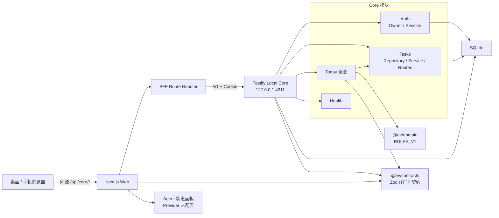

# EV AI Dashboard v0.1.0 Code Intel 与基线审计

## 1. 审计结论

`v0.1.0` 在提交 `83f4b37bce696b65243c3b6ae2e69da4f9438c1d` 上形成了一条真实、可运行的本地纵向链路：唯一 Owner 初始化与登录、同源 Web/BFF、只监听 loopback 的 Fastify Core、SQLite 持久化、版本化任务 API、规则驱动的 Today 聚合，以及明确标为“未配置”的 Agent 状态。该提交已标记 `v0.1.0`，并发布为私有 GitHub Pre-release：`v0.1.0 – Local Owner Task Dashboard`。

基线没有发现已证实的 P0 问题。自动化基线 45 项测试和 1 条 E2E 均通过，桌面与移动端常规视口没有横向溢出或控制台报错。然而，当前 UI 的“任务”和“Agent”只是 `/today` 内的 hash 锚点，不是真实页面；启动认证状态、Today 超过 100 项任务的聚合、BFF 本机边界、任务创建后刷新失败、部分响应式可访问性和测试隔离存在 P1 缺口。它适合作为技术预览，不应被描述为已经具备可对话 Agent、独立任务工作区或长期记忆的成品。

Code Intel lite 核心分析结果为 `PASS/completed`，没有首个失败分类。稳定版 Code Intel `v0.6.0` 此次只生成 content-addressed JSON，没有生成 `summary.md`、`hospital.md`、`understanding.md` 或 `report.json`。这是稳定版的人类可读报告层缺失，不是核心扫描失败；本文没有伪造这些文件，而是按 manifest 引用直接读取 JSON 对象，并用源码、测试和真实浏览器结果交叉验证。

## 2. 范围与基线

| 项目 | 审计基线 |
| --- | --- |
| 仓库 | `Fancy0uth/ev-ai-assistant`（private） |
| 提交 | `83f4b37bce696b65243c3b6ae2e69da4f9438c1d` |
| 标签 / Release | `v0.1.0` / GitHub Pre-release |
| Release 名称 | `v0.1.0 – Local Owner Task Dashboard` |
| 产品边界 | 本地唯一 Owner、任务、Today 规则状态、Agent 未配置状态 |
| 审计日期 | 2026-08-10 |
| Code Intel 模式 | `lite` |
| Code Intel 版本 | 已安装稳定版 `v0.6.0` |
| Code Intel 结果 | `completed`，核心节点均 `pass` |
| 自动化基线 | 45 项测试通过；1 条 Playwright E2E 通过；typecheck、lint、build、`git diff --check` 通过 |

本报告审计当前本地主线及其发布提交，不审计外部模型供应商、云服务、手机原生 App、Tailscale、Docker、Apple 日历、小米手环或学校平台，因为这些能力不在 `v0.1.0` 中。

## 3. 方法与证据优先级

审计按以下顺序取证：

1. 检查 Git 提交、标签、工作树和私有 Pre-release 元数据。
2. 阅读 `README.md`、当前权威规格、实施计划、ADR-001 至 ADR-008 和任务总览。
3. 阅读 Web、Core、contracts、domain、迁移和测试源码。
4. 读取 Code Intel `run-complete.json`、manifest 及其引用的 content-addressed JSON 对象。
5. 对照自动化测试结果和真实浏览器桌面/移动基线。

证据优先级为：可执行测试和运行时观察 > 当前提交源码 > 已接受 ADR/规格 > Code Intel 启发式索引 > 历史计划。Code Intel 不提供精确调用图，因此本文不会仅凭它推断运行时调用关系。

## 4. Code Intel 证据账本

### 4.1 产物目录与状态

产物根目录：

```text
C:\Users\asus\AppData\Local\code-intel\artifacts\ev-ai assistant\1786308022332-11636-core
```

入口文件：

```text
run-complete.json
objects/sha256/38b8af4eba0017d16772bf73789d34c240c8935c2b63c61578307000f77599fb
```

`run-complete.json` 指向上述 manifest；manifest 的 `outcome` 为 `completed`。四个执行节点状态如下：

| 节点 | 状态 | 判定 |
| --- | --- | --- |
| `repo.snapshot` | succeeded | pass |
| `inventory.rg` | succeeded | pass |
| `doctor` | succeeded | pass |
| `evidence.native-code` | succeeded | pass |

首个失败分类：无。Repowise 未安装，但在 lite 模式下是可选 provider，不构成核心失败。Sentrux 已安装且 doctor 判定 ready，但本次 core run 的 manifest 中没有 Sentrux 执行节点，因此不能声称本基线已做结构回归判定。`graph.code-intel` provider 显示存在但不可用，coverage 同时把 call graph 标记为 `unknown`。

### 4.2 对象映射

| 证据 | SHA-256 对象 |
| --- | --- |
| Manifest | `38b8af4eba0017d16772bf73789d34c240c8935c2b63c61578307000f77599fb` |
| Repository snapshot | `a2162f443d2a73263fbdb79adcdb42443f94f03bedd79b63beb588ea4e8f9f96` |
| Doctor observation | `9284ce4e192fa6dcbee8fef545d31852978541454ad16bcd4a05b787878eb936` |
| File inventory | `5c969fd47ab91b1450ab7cfa8c5b39c82bc545b862e34ac6a426b4fceaf2369f` |
| Native files | `f481ef08e4e73cbb40ed9f249c18e80cff271903b148d6301c19fccd01594d0d` |
| Native symbols | `a70ffd66170b90a622d57709077274d1a098650f16912193a2a75809491dcc47` |
| Native chunks | `dcdd367a13d43775affbf168dd82432882083ac29e83eb8ee19e0fb70d3aa558` |
| Symbol/chunk mapping | `1635ce63ba9c4fa310dedb55d6b4f8b7e8aa956bc9aed55dec98ad09a4cedd3e` |
| Imports | `fb869178e0aa47cfe4f59f1369268901e878fe6d5b9a64ae8f413c0c23763c24` |
| Scorecard | `3ee3de56f251ba65bc10b74451df73c322f9489cb8ff5f2aa06caf8ce8815b59` |
| Coverage | `e0d5ec6d335b3aa28d1fd468513eb2339361500c6374d188bd88ef6343453fbf` |
| Agent slice ranking | `c406211718be800553009524afee5271eac3a4ab4e8861d96139b35b29e9b660` |

### 4.3 指标与可信度

| 指标 | 结果 | 解读 |
| --- | --- | --- |
| Files | 97 | Git 快照内 inventory 文件数 |
| Symbols | 136 | line-heuristic 识别结果，不是 AST 精确符号表 |
| Imports | 190 | heuristic 结果，可能包含误识别 |
| Chunks | 97 | 每个文件形成一个 fallback chunk |
| `nativeMinimal` | `true` | 使用 native-minimal 证据路径 |
| `parserKind` | `line-heuristic` | 非完整语言解析器 |
| `symbolPrecision` | `heuristic` | 不可视为编译器精度 |
| `importPrecision` | `heuristic` | 不可直接构造精确依赖图 |
| `fallbackChunkRate` | `1.0` | 全部 chunk 均为 fallback 分段 |
| `callGraph` | `unknown` | 无可用调用图 |
| Dirty overlay | `false` | 快照对应干净工作树 |
| Snapshot HEAD | `83f4b37...` | 与发布基线一致 |

Code Intel 的 Git 快照、rg inventory、哈希对象和节点状态可以作为精确的“扫描了什么、产出了什么”证据。符号、导入、关系和热点得分只能作为导航线索。CSS、Markdown、JSON 等被 coverage 列为 unsupported；例如 1200 行的 `dashboard.css` 在 Agent slice 中只有 inventory 分数，不能因为得分低就判断风险低。本文对 UI、认证、查询和迁移的结论均回到源码或测试核验。

### 4.4 人类可读报告层缺失

在产物根目录中逐一检查结果为：

| 预期文件 | 是否存在 |
| --- | --- |
| `summary.md` | 否 |
| `hospital.md` | 否 |
| `understanding.md` | 否 |
| `report.json` | 否 |

因此，技能说明中的常规阅读顺序在稳定版 `v0.6.0` 的这次 DAG 产物上无法执行。可用替代证据是 `run-complete.json` → manifest → 哈希对象。核心 DAG 完整并通过，缺失的是人类可读汇总层；没有安装 prerelease，也没有生成或补写冒充官方产物的文件。

## 5. 当前架构



该图表达的是源码确认的边界，不是 Code Intel 调用图。当前没有 Agent provider 调用、Agent loop、长期记忆或外部服务节点。

## 6. 模块职责

| 模块 | 当前职责 | 审计观察 |
| --- | --- | --- |
| `apps/web/src/app` | `/`、`/setup`、`/login`、`/today` 页面；同源 BFF；全局样式 | 构建产物只有四类页面；尚无 `/tasks` 和 `/agent` |
| `apps/web/src/components/auth` | Owner 初始化/登录表单、客户端校验和错误展示 | `/` 固定跳 `/setup`；页面没有先解析 setup/session 状态 |
| `apps/web/src/components/shell/app-shell.tsx` | 桌面侧栏、移动底栏、退出和 Agent 侧栏容器 | 导航状态由组件 state + hash 锚点维护，不由 pathname 维护 |
| `apps/web/src/components/today/today-dashboard.tsx` | 拉取 Today、创建/更新任务、刷新、退出、装配全部 Today UI | 223 行客户端协调器，是 Web 行为耦合热点 |
| `apps/web/src/app/api/core/[...path]/route.ts` | 固定形状的 `/v1` 代理、Cookie 和 Set-Cookie 转发、错误归一化 | 路径段有校验，但环境配置允许任意 HTTP(S) origin，并转发完整 Cookie header |
| `apps/core/src/app.ts` | 数据库创建、插件、repository/service/route 组装 | Code Intel slice 得分 65，是明确 composition root；集中依赖属于预期，但扩展时需保持模块化 |
| `apps/core/src/modules/auth` | 单 Owner、scrypt 密码、摘要会话、HttpOnly Cookie、认证 guard | setup 409、登录 401、5 次/分钟限流和退出撤销均有测试 |
| `apps/core/src/modules/tasks` | Owner 隔离的创建、分页、筛选、乐观并发更新 | `owner_id` 进入查询和更新条件；409 防止静默覆盖 |
| `apps/core/src/modules/today` | 读取指定日期任务并调用规则引擎生成快照 | 固定读取第一页 100 项；`yesterday` 固定为 `null` |
| `apps/core/src/storage` | WAL/foreign keys/busy timeout 与顺序迁移 | 当前只有 migration 1；后续加法迁移前必须补升级保真测试 |
| `packages/contracts` | Auth、Task、Today、Health 的 Zod 契约 | Web/Core 的有效稳定边界；Agent 契约尚不存在 |
| `packages/domain` | 无 I/O 的 `RULES_V1` Today 状态计算 | 规则确定且有边界测试；输入完整性取决于 Today 查询 |
| 根目录静态 Demo | `index.html`、`src/dashboard.js`、`styles.css` 与 legacy test | 不在 Next.js 运行链路中，但仍被 `npm test` 执行，属于历史参考/维护噪声 |

## 7. 数据流与认证边界

### 7.1 登录与会话

1. 浏览器向同源 `/api/core/auth/setup` 或 `/api/core/auth/login` 发送账号信息。
2. BFF 把请求代理至 `${EV_CORE_URL}/v1/...`，并把 Core 的 `Set-Cookie` 返回浏览器。
3. Core 用 Zod 校验用户名和密码；密码要求 12–128 字符。
4. 密码用参数固定的 scrypt 加盐派生；数据库保存 `password_hash`，不保存原始密码。
5. 会话 token 由 32 字节随机数生成；数据库只保存 SHA-256 摘要。
6. `ev_session` Cookie 为 HttpOnly、SameSite=Strict；生产或显式配置下启用 Secure。
7. 受保护路由通过摘要查 session，得到 Owner 后再调用任务或 Today 服务。

单 Owner 由 `owners.singleton_key = 1` 的数据库约束和 setup 前检查共同保证。会话、任务均带 `owner_id` 外键；任务的查找、列表和更新查询都包含 Owner 条件。当前产品不是多用户系统，这里的“Owner 隔离”是防止越权访问其他 Owner ID 的代码边界，不是多租户承诺。

### 7.2 任务闭环

1. Web 创建任务时使用共享契约字段，并把 Today 日期作为 `targetDate`。
2. Core 创建 UUID、`version = 1` 和时间戳，写入 SQLite。
3. 更新必须携带当前 version；SQL 以 `id + owner_id + version` 更新并把 version 加一。
4. stale version 返回 `409 VERSION_CONFLICT`，不会覆盖较新数据。
5. Today 读取任务并把列表交给纯函数 `calculateDailyStatus`，返回 `RULES_V1` 分数、理由和前三项优先任务。

### 7.3 本地边界的优点与缺口

Core 配置拒绝非 `127.0.0.1` 的监听地址，SQLite 只有 Core 写入，浏览器只访问同源 BFF，这些设计符合 ADR-005 的本地优先边界。需要修正的缺口是：BFF 的 `EV_CORE_URL` 目前接受任意 HTTP(S) origin，并把请求中的完整 Cookie header 转发给该 origin。该值不是浏览器请求参数，通常由部署者控制，但错误或恶意配置会把本机 Cookie 边界扩大；v0.2 应只允许 loopback origin，并只转发 `ev_session`。

## 8. 热点与耦合

| 热点 | 证据 | 风险与建议 |
| --- | --- | --- |
| `apps/core/src/app.ts` | 49 行；Code Intel slice 65，导入所有 Core 模块 | 合理的 composition root。新增 Agent 时只组装 ports/services/routes，不把业务策略写进此文件 |
| `apps/web/src/components/today/today-dashboard.tsx` | 223 行；同时处理读取、错误、任务 mutation、刷新、退出和页面装配 | 真实路由和独立 Tasks/Agent 页面应共享 authenticated shell 与数据客户端，避免继续堆入 Today 控制器 |
| `apps/web/src/components/shell/app-shell.tsx` | 139 行；内部 state 决定激活项，并绑定 Today DOM id | 与 `/today` DOM 结构耦合；改为 pathname 驱动的真实 Link 后，刷新/前进/后退才可靠 |
| `apps/core/src/storage/migrations.ts` | 85 行；单文件拥有全部表结构和原子迁移逻辑 | migration 1 已发布后应保持不可变；Agent 表只能通过 migration 2 加法升级，并验证 Owner/Task 不丢失 |
| `apps/web/src/app/dashboard.css` | 1200 行 / 22,017 bytes；Code Intel coverage 不支持 CSS | 响应式规则、全部 Dashboard 组件样式集中；v0.2 只做必要修复，不在本轮进行设计系统重写 |
| Today → TaskService → paginated repository | Today 固定 `page=1, pageSize=100` | 聚合正确性被列表分页上限约束；应提供面向日期完整聚合的 repository 查询或拆分 aggregate/list 读取 |
| 根目录静态 Demo 与生产 Web 并存 | inventory 同时包含静态 Demo 与 Next.js；legacy test 仍运行 | 暂不删除，避免本轮扩大范围；后续明确归档或标记，降低 agents/维护者误判入口的风险 |

## 9. 测试覆盖与缺口

### 9.1 已有覆盖

基线执行结果：

| 测试层 | 通过数 | 主要覆盖 |
| --- | ---: | --- |
| Legacy | 3 | 旧静态 Demo 状态计算和区域存在性 |
| Core | 22 | health、配置、SQLite、密码、auth、task、Today |
| Web | 11 | auth 表单、BFF、hash 导航、Today 任务创建和 401 |
| Contracts | 6 | Auth/Task/Today schema 边界 |
| Domain | 3 | Today 分数、惩罚上限、优先项排序 |
| 合计 | 45 | 全部通过 |
| Playwright E2E | 1 | setup → Today → 创建 → reload → 完成 → mobile/desktop 尺寸 → logout → 401 |

同时通过 `npm run typecheck`、`npm run lint`、`npm run build` 和 `git diff --check`。E2E 使用独立 `EV_DATA_DIR`，没有读取、重置或迁移用户现有数据库。

已证实的质量能力包括：唯一 Owner、认证 cookie、原始密码/token 不入库、登录限流、任务 Owner 条件、分页上限、409 version conflict、SQLite 重开持久化、WAL/外键/busy timeout、Today 规则真实性、Agent 未配置不伪造模型调用、E2E 键盘基本路径和移动触摸目标。

### 9.2 需要在 v0.2 补齐的测试

1. migration 1 → migration 2 升级，证明 Owner、session 和 Task 行不丢失，且新 Agent 表存在。
2. `/` 在“未初始化 / 已初始化未登录 / 已登录 / Core 不可用”四种状态下的启动决策。
3. `/today`、`/tasks`、`/agent` 的直接打开、刷新、前进和后退。
4. 任务分页、领域/状态/日期筛选、编辑、完成、延期、取消和 UI 409 冲突保留服务端最新值。
5. Today 日期任务超过 100 项时，聚合数量和分数仍使用完整集合。
6. 任务 POST 成功但后续 Today refresh 失败时，输入框不诱导重复创建，并提供恢复路径。
7. BFF 拒绝非 loopback `EV_CORE_URL`，且只转发 `ev_session`，不转发其他 Cookie。
8. Agent 未配置时 POST message 返回 `503 AGENT_PROVIDER_NOT_CONFIGURED`，且数据库零消息写入；测试注入 provider 时才写入 user/assistant 消息。
9. 1440×900、1024×768、390×844、320×800 四个独立浏览器上下文，覆盖控制台 warning/error、网络失败、横向溢出、长文本、键盘焦点和触摸目标。
10. E2E 使用与用户预览不同的端口与数据目录，避免 `reuseExistingServer: false` 在 3000/4311 已占用时阻断测试。

当前没有生成行/分支覆盖率报告，因此不能把“45 项通过”解释为完整代码覆盖。

## 10. 真实桌面与移动基线

以下为同一发布提交、隔离测试数据上的真实浏览器观察；没有读取用户现有数据库：

| 视口 | 结果 |
| --- | --- |
| 1440×900 | 桌面三栏可见，无横向溢出；主导航和右侧 Agent 状态可见；控制台无 error/warning |
| 1024×768 | 桌面压缩布局可见，无横向溢出；导航文字被隐藏为图标；控制台无 error/warning |
| 390×844 | 移动底栏可见，无横向溢出；任务、表单和操作触摸目标约 47px；Agent details 可展开 |
| 320×800 | 单列布局和移动底栏可用，无常规内容横向溢出；控制台无 error/warning |

导航运行事实：

- 桌面点击“任务”后 URL 是 `/today#today-tasks`，页面主标题仍是 Today。
- 桌面点击“Agent”后 URL 是 `/today#agent-status`，页面主标题仍是 Today。
- 移动点击“任务”后 URL 是 `/today#today-tasks`。
- 移动点击“Agent”后 URL 是 `/today#agent-mobile`，并展开 `<details>`。

因此，按钮“有响应”，但产品语义仍是页内定位，不是独立路由。手工压力测试还观察到 200 字符无断点标题可使部分任务/建议表面形成约 1901px 的内容宽度；常规标题没有复现该问题。相关 CSS 缺少统一的 `overflow-wrap:anywhere`，v0.2 应加入长字符串回归测试。1024px 下 `.primary-nav__item span` 和 `.logout-button span` 被 CSS 隐藏，而 SVG 标记为 `aria-hidden`，这些仅图标控件没有稳定的可访问名称。移动表单输入字号为 `0.75rem`，在 iOS 浏览器可能触发聚焦缩放；应提升到至少 `1rem`。

本轮没有保留可纳入仓库的截图文件，因此报告只记录 DOM、URL、视口、控制台和尺寸观察，不声称存在截图证据。

## 11. Supabase 历史 worktree 的弃用边界

Supabase 方案确实存在于历史规格、历史计划和一个仍保留在本机的隔离 worktree 中：

- 历史分支：`codex/web-core-daily-cockpit`
- 历史 worktree：`.worktrees/web-core-daily-cockpit`
- 历史分支 HEAD：`71bbe3162e8ed35a8b870994cab65c651d4a1712`
- 与当前发布线的共同祖先：`ed27e9bf9d33f73c11e831177760af5262409547`

该分支包含 Supabase/RLS 方向的独有提交，但没有合并到 `v0.1.0`。当前权威规格明确取代 Supabase + Bridge 设计；ADR-005 supersede ADR-001/ADR-002；历史实施计划首页也明确标记“不再执行”。当前 `v0.1.0` 的依赖和运行源码没有 Supabase package、Supabase client 或 Supabase migration，`supabase` 字样只出现在历史/决策文档和任务说明中。

这里的“弃用”表示：历史 worktree 不再是实施依据，也不属于当前运行链路；不表示本次审计已删除该 worktree、分支或历史提交。保留它不会让当前本地主线在运行时依赖 Supabase，但后续维护者应避免在该历史 worktree 继续开发或把其中提交误合并回本地主线。

## 12. 按严重级别分类的发现

### P0 — 当前未发现

没有证实数据已损坏、密钥已暴露、应用无法启动或现有 Owner/Task 核心流程完全不可用。后续 migration 2 若没有升级保真测试，会形成潜在 P0 发布风险，但这不是当前 migration 1 数据已损坏的证据。

### P1 — v0.2 必须处理

| ID | 发现 | 证据 / 影响 | 建议处理 |
| --- | --- | --- | --- |
| P1-01 | 任务和 Agent 不是实际路由 | `AppShell` 使用 hash 和本地 state；构建无 `/tasks`、`/agent` | 建共享 authenticated layout 和真实路由，pathname 驱动选中态 |
| P1-02 | 认证启动流程不解析系统状态 | `/` 无条件 redirect `/setup`；setup/login 页面不先查 setup/session | 建统一状态解析，区分 setup/login/today/Core unavailable，避免第二账号错觉和循环跳转 |
| P1-03 | BFF 本机边界不够严格 | `EV_CORE_URL` 接受任意 HTTP(S) origin；转发完整 Cookie header | 只允许 loopback origin，只转发 `ev_session`，补负向测试 |
| P1-04 | Today 聚合最多使用 100 项 | route 固定 `page=1,pageSize=100` | 聚合使用完整日期数据或独立 aggregate 查询，补 101 项测试 |
| P1-05 | 创建成功后刷新失败会诱导重复创建 | `createTask()` 只有 `refresh()` 为 true 才让 composer 清空 | 201 后立即进入“已创建”状态并清空；刷新失败单独提示和恢复，补重复防护测试 |
| P1-06 | 压缩桌面和极端标题可访问性不足 | 1024px 图标控件无稳定名称；200 字符无断点文本可扩宽内容 | 加 aria-label、`min-width:0`/`overflow-wrap:anywhere` 和长文本浏览器测试 |
| P1-07 | 移动表单字号过小 | 输入/select 为 `0.75rem`，320/390 布局虽不溢出但 iOS 可能聚焦缩放 | 移动输入字号至少 `1rem`，保持 44px 触摸目标 |
| P1-08 | E2E 与预览共享固定端口 | Playwright 固定 3000/4311 且 `reuseExistingServer:false` | 使用独立测试端口和独立数据目录；四视口独立 context |
| P1-09 | 下一次迁移缺少升级保真门 | 当前测试只验证 migration 1 幂等重开 | migration 2 必须是加法迁移，并先写 001→002 Owner/Task/session 保真测试 |

独立 Tasks 页面和 provider-neutral Agent 会话框架是已批准的 v0.2 目标，不是 `v0.1.0` 对其发布说明的回归；但 v0.2 不能在缺少它们时通过验收。

### P2 — 记录但本轮不扩张

| ID | 发现 | 决定 |
| --- | --- | --- |
| P2-01 | `dashboard.css` 1200 行集中承载全部 Dashboard 响应式样式 | 本轮仅修 P1 样式，不做设计系统重写 |
| P2-02 | `TodayDashboard` 同时负责网络、mutation、刷新、退出和页面装配 | 随真实路由提取最小共享边界，不引入新状态库 |
| P2-03 | 根目录旧静态 Demo 与 Next.js 产品并存 | 暂保留；后续单独归档/删除，不混入 v0.2 功能提交 |
| P2-04 | Code Intel v0.6.0 缺人类可读汇总层，CSS/docs 也不在 native parser 支持范围 | 保留 JSON 证据路径；不升级 prerelease，不把该工具缺口当产品失败 |
| P2-05 | 当前 E2E 只收集 console error，不在测试代码中收集 warning | v0.2 四视口 E2E 同时断言 warning/error；不引入遥测平台 |
| P2-06 | 没有代码覆盖率数字 | 后续选择性加入，不以覆盖率百分比替代关键路径测试 |

### P3 — 后续产品路线

- Event、TimeBlock、Routine、Reminder、Scheduler 与昨日统计。
- 真实 DeepSeek/Codex provider、路由、审批、工具执行和异步任务。
- 长期记忆、生活/健身/饮食、项目 Future Work 和 Git 仓库执行。
- Apple 日历、小米手环、课程平台、GitHub 云端集成。
- Tailscale、Docker、备份恢复、原生 iOS/Android、多用户或公共 SaaS。

这些功能不得为了“看起来更像 Agent”而塞入本次 Dashboard 稳定化。尤其不能在 provider 未配置时生成假回复，也不能在没有审批/权限边界时加入 Shell、仓库写入、push 或 merge。

## 13. v0.2 建议边界

建议把 `v0.2.0` 明确定义为产品路线之外的“Dashboard 稳定化版本”，只完成以下边界：

1. 真实 `/today`、`/tasks`、`/agent` 路由和共享 authenticated shell。
2. 正确的 setup/login/session/Core unavailable 启动流程。
3. 复用现有 Task API 的独立任务工作区，支持分页、筛选、编辑和状态闭环，UI 正确处理 409。
4. provider-neutral 的 AgentSession、AgentMessage、AgentCapability 契约、SQLite migration 2 和 Owner 隔离 API。
5. 未配置 provider 时发送接口返回 `503 AGENT_PROVIDER_NOT_CONFIGURED`，发送前失败且零消息落库；生产环境不内置假回复。
6. 修复本文 P1-03 至 P1-09，并把四视口、迁移升级、Agent 503/no-write 纳入发布门。
7. 新增 `CHANGELOG.md`，把 v0.1.0 明确标为技术预览；v0.2.0 在 PR 合并前不打标签。

v0.2 不接真实模型 API，不实现长期记忆、Scheduler、生活模块、外部集成、远程访问、Docker、原生 App、多用户或破坏性数据迁移。新增结构应遵循现有 `packages/contracts`、`packages/domain`、Core module 和 provider port 边界，不引入 ORM、全局状态库或另一套后端。

## 14. 最终判断

`v0.1.0` 达到了“本地 Owner Task Dashboard 技术预览”的真实边界：数据落在本机 SQLite，核心非 AI 功能可运行，Agent 未配置状态没有伪装成模型能力，发布提交和自动化基线一致。它还不是用户目标中的个人 AI Dashboard 成品。

下一步不应扩大产品范围，而应先把导航、认证启动、任务工作区、provider-neutral Agent 会话骨架、本机安全边界和测试隔离做成可持续的模块。完成本文 P1 和既定 v0.2 契约后，再进入 Scheduler、provider、记忆和生活/项目能力，能最大限度降低在不稳定 UI 与数据基础上堆叠 Agent 功能的风险。
