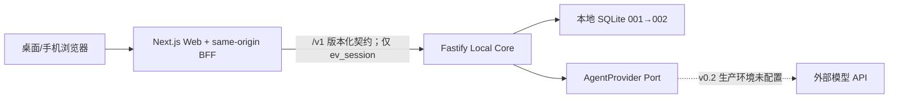

# EV AI Dashboard v0.2.0 改进设计规格

## 1. 文档状态

- 状态：已冻结，等待实现。
- 日期：2026-08-10。
- 基线：Git 提交 `83f4b37`，GitHub 私有技术预览版 `v0.1.0`。
- 版本语义：本文的 `v0.2.0` 是“Dashboard 稳定化与最小可对话 Agent 框架”，不是产品路线图中的 Event/Scheduler Milestone 0.2。
- 权威边界：以已批准的 `2026-08-07-local-first-personal-ai-dashboard-v2-design.md`、ADR-005 至 ADR-008，以及本文件列出的本轮范围为准。更早的 Supabase、Bridge 与 `.ics` 方案仅作历史记录。

本文件只冻结产品和工程契约，不表示相关功能已经完成。问题证据来自 `83f4b37` 的源码、现有自动化测试、构建路由清单，以及 2026-08-10 在 1440×900、1024×768、390×844、320×800 下完成的本地浏览器审查。没有生成截图的检查只引用文字实测记录和可复查源码，不伪造截图。

## 2. 本轮目标与非目标

### 2.1 目标

1. 把 Today、Tasks、Agent 变成可直接访问、刷新和前进/后退的真实页面，并共享单 Owner 认证外壳。
2. 让根路由和认证页面依据真实初始化与会话状态进入 `/setup`、`/login` 或 `/today`，不再暗示可创建第二 Owner 或存在预览账号。
3. 提供独立 Tasks 页面，复用现有版本化 Task API，完成分页、领域/状态/日期筛选以及创建、编辑、完成、延期、取消闭环。
4. 在不接入真实模型的前提下建立 provider-neutral Agent 契约、SQLite 数据、Core API 和对话 UI；未配置 Provider 必须明确失败，不生成假回复。
5. 修复审计中确认的 P1，并用隔离数据、独立端口和四种视口建立可重复 E2E 门禁。
6. 证明 SQLite 001→002 为加法升级，原有 Owner、session、Task 不丢失。

### 2.2 明确拒绝

本轮不实现：

- Event、TimeBlock、Routine、Reminder、Scheduler、昨日统计与每日调度；
- Apple 日历、小米手环、学校课表/课程平台、GitHub 云端同步；
- Docker、Tailscale、产品云端、原生 iOS/Android、多用户或多租户；
- 真实 DeepSeek/Codex/OpenAI Provider、API Key 管理、流式响应、队列和后台长任务；
- tools、Shell、审批中心、长期记忆、RAG、项目 Runner 或外部副作用；
- ORM、全局状态库、设计系统或框架级大重写；
- 单独的 `/generate` 接口。消息生成只通过已批准的会话消息资源完成。

审计中新发现的 P0/P1 可纳入本轮；P2/P3 只记录。任何新外部服务、凭据、破坏性迁移或产品范围扩张都必须暂停并重新批准。

## 3. 当前架构与改造边界



- Web 只负责页面、交互和 same-origin BFF；Core 继续是认证、Task 与 Agent 数据的唯一所有者。
- `packages/contracts` 是 Web/Core 的唯一跨进程类型边界；新增字段和查询保持 `/v1` 内加法兼容。
- Provider 通过 Port 注入。测试可注入 Fake Provider；生产组合根不实例化 Fake Provider。
- SQLite migration 001 不修改；migration 002 只新增 Agent 表和索引。
- 右侧助手面板在桌面 Dashboard 路由中持续存在；移动端通过真实 `/agent` 页面承载完整对话体验。

## 4. 审计问题清单

### P1-01：Today、Tasks、Agent 不是独立路由

- 复现步骤：在 1440×900 或 1024×768 打开 `/today`，点击左侧“任务”或“Agent”；在 390×844 或 320×800 点击底部同名入口；再尝试刷新或浏览器后退。
- 预期：地址分别变为 `/tasks`、`/agent`；页面主体、选中状态和历史记录与 pathname 一致；直接访问和刷新仍可用。
- 实际：地址只变为 `/today#today-tasks`、`/today#agent-status` 或 `/today#agent-mobile`，主标题仍是 Today；选中状态是组件局部 state。
- 证据：本地四视口实测；`apps/web/src/components/shell/app-shell.tsx` 使用 `href="#..."`、`document.getElementById` 和 `useState('today')`；当前构建只有 `/`、`/setup`、`/login`、`/today`。
- 根因：v0.1 把导航实现成单页锚点演示，没有路由级页面与共享 authenticated layout。
- 严重级别：P1。
- 处理决定：本轮实现真实 `/today`、`/tasks`、`/agent`，使用 Next.js `Link` 和 pathname 决定活动项，覆盖直接加载、刷新、前进和后退。

### P1-02：认证入口不依据初始化和会话状态

- 复现步骤：已有 Owner 时访问 `/` 或 `/setup`；未初始化时访问 `/login`；Core 停止时访问任一认证入口。
- 预期：`/` 查询 setup-status 和 session 后进入正确页面；已有 Owner 不出现第二账号表单；未初始化登录页转到 setup；Core 不可用显示可重试错误且不循环跳转。
- 实际：`apps/web/src/app/page.tsx` 无条件跳到 `/setup`；`/setup` 和 `/login` 直接渲染表单；登录页仍提供“创建本地账号”链接。第二次 setup 最终只能依靠 Core 409 拒绝。
- 证据：上述页面与 `apps/web/src/components/auth/auth-form.tsx`；`apps/core/tests/auth.test.ts` 已证明 Core 只允许一个 Owner 并返回 `SETUP_ALREADY_COMPLETED`。
- 根因：Core 的初始化状态已经存在，但 Web 没有统一 startup/auth resolver。
- 严重级别：P1。
- 处理决定：增加共享启动解析逻辑；表单显示前先完成状态判断；分别呈现 409、429、错误密码和 Core 不可用；不增加密码重置、预览账号或数据清除。

### P1-03：1024px 图标控件失去可访问名称

- 复现步骤：在 1024×768 打开 `/today`，检查左侧主导航和退出按钮的可访问名称，或用键盘聚焦后让屏幕阅读器读取。
- 预期：文字视觉隐藏时，“今天”“任务”“Agent”“退出”仍有稳定 accessible name。
- 实际：`@media (max-width: 72rem)` 隐藏 `.primary-nav__item span` 和 `.logout-button span`，同时图标均 `aria-hidden="true"`；相关控件没有稳定 `aria-label`。
- 证据：`apps/web/src/app/dashboard.css` 的 978–1009 行附近规则；`apps/web/src/components/shell/app-shell.tsx`。
- 根因：响应式视觉压缩没有同步保留语义标签。
- 严重级别：P1。
- 处理决定：所有图标导航与退出控件提供与 viewport 无关的可访问名称，并加入组件测试。

### P1-04：200 字符无断词标题可造成横向溢出

- 复现步骤：创建一个由 200 个连续非空字符组成的任务，在 320×800 和桌面优先级/任务表面查看布局宽度。
- 预期：标题在卡片边界内换行或安全截断，文档宽度不超过 viewport。
- 实际：移动 QA 观察到长标题内容宽度约 1901px；部分 Task/priority 表面缺少完整的 `min-width: 0` 与断词兜底。
- 证据：本地 320×800 最大长度实测（无截图）；`taskTitleSchema` 允许 200 字符；`apps/web/src/app/dashboard.css` 只在部分 `.task-row` 标题上使用单行 ellipsis，其他消费面没有统一 `overflow-wrap`。
- 根因：数据边界允许长标题，但每个网格/flex 消费面没有统一的不可断字符串约束。
- 严重级别：P1。
- 处理决定：所有任务标题和优先级卡片链路设置 `min-width: 0`，对需要多行的表面使用 `overflow-wrap: anywhere`，并增加 320px E2E 溢出断言。

### P1-05：移动任务表单字号可能触发 iOS 自动缩放

- 复现步骤：在 iPhone 尺寸打开 Today，聚焦任务输入框或下拉框。
- 预期：移动表单控件计算字号至少 16px，聚焦不触发 Safari 页面自动缩放。
- 实际：`.task-composer input, select` 使用 `font-size: 0.75rem`；移动媒体查询只提高最小高度，没有提高字号。
- 证据：`apps/web/src/app/dashboard.css` 的表单规则和 `max-width: 42rem` 规则。
- 根因：触摸目标尺寸与文本字号被当作同一问题处理，遗漏 iOS 聚焦行为。
- 严重级别：P1。
- 处理决定：移动任务输入和选择控件使用至少 `1rem` 计算字号，保持 44px 触摸目标。

### P1-06：Task 已创建但 Today 刷新失败时可能重复创建

- 复现步骤：让 `POST /v1/tasks` 返回 201，随后让 `GET /v1/today` 失败；观察输入框，再点击提交重试。
- 预期：201 后立即清空或标记已提交；刷新失败只提示“任务已保存、列表刷新失败”，重试刷新不能再次 POST 同一草稿。
- 实际：`TodayDashboard.createTask()` 返回 `refresh()` 的 boolean；`TaskComposer` 只在该 boolean 为 true 时清空标题。201 后刷新失败返回 false，输入保留，用户重试会创建第二条任务。
- 证据：`apps/web/src/components/today/today-dashboard.tsx` 与 `task-composer.tsx`；现有测试没有覆盖“201 成功、随后 GET 失败”。
- 根因：持久化成功和投影视图刷新成功被折叠为一个 boolean。
- 严重级别：P1。
- 处理决定：创建结果区分“写入成功”和“刷新成功”；确认 201 后清空草稿，刷新失败显示恢复操作，绝不自动重发 POST。

### P1-07：Today 只统计前 100 条任务

- 复现步骤：为同一天创建 101 条以上任务，请求 `GET /v1/today?date=...`，比较数据库总数、返回任务与状态原因。
- 预期：Today 状态使用当天全部任务计算；响应展示策略明确，不能把第 101 条以后从负载统计中静默遗漏。
- 实际：`registerTodayRoutes` 调用 `taskService.list({ page: 1, pageSize: 100, targetDate })`，然后仅用 `taskPage.items` 计算状态。
- 证据：`apps/core/src/modules/today/routes.ts`；`apps/core/tests/today.test.ts` 只覆盖三条当天任务。
- 根因：把面向 UI 的分页查询直接当作聚合数据源。
- 严重级别：P1。
- 处理决定：Repository 提供 Owner+日期范围内的完整 Today 查询或独立聚合输入；Today 状态必须覆盖 101+，响应可继续返回完整当天任务直到后续专门设计 Today 分页。

### P1-08：BFF 可连接任意 HTTP(S) 主机并转发全部 Cookie

- 复现步骤：把 `EV_CORE_URL` 设为非 loopback HTTP(S) origin，并带任意额外 Cookie 请求 `/api/core/...`。
- 预期：Web 只允许 `127.0.0.1`、`localhost` 或 `[::1]` Core；只转发 `ev_session`。
- 实际：`coreBaseUrl()` 只检查协议、userinfo 和纯 origin，允许任意主机；代理直接复制完整 `cookie` 请求头。
- 证据：`apps/web/src/app/api/core/[...path]/route.ts`；现有 `core-proxy.test.ts` 没有覆盖恶意 Core origin 和 Cookie 最小化。
- 根因：输入格式校验存在，但没有落实 ADR-005 的 loopback 信任边界和最小凭据原则。
- 严重级别：P1。
- 处理决定：拒绝非 loopback origin；解析 Cookie 并只重建 `ev_session`；增加正反测试。

### P1-09：Task 查询契约已接受筛选但 Core 未执行

- 复现步骤：创建不同领域、状态、目标日期和未安排日期的任务，分别请求 `area=WORK`、`status=DONE`、`dateScope=FUTURE&referenceDate=2026-08-10`、`dateScope=UNDATED`。
- 预期：rows 与 pagination total 都只基于 Owner 范围内匹配条件的任务，多个条件按 AND 组合，分页发生在筛选之后。
- 实际：Core repository 只应用 Owner 与可选 `targetDate`；上述四种请求均返回未筛选集合，total 也是全量值。
- 证据：Task 11 独立 Sol 审查的临时 SQLite/API probe；`apps/core/src/modules/tasks/repository.ts` 的 list predicate。
- 根因：Task 2 只冻结了加法查询契约，实施计划遗漏了 Core repository 对新增条件的执行切片。
- 严重级别：P1。
- 处理决定：在 Task 11 封账前增加独立两文件 Core 切片；rows/count 共用同一静态构造谓词，覆盖单项、组合、Owner 隔离和筛选后 pagination。

### P1-10：Tasks 编辑器刷新会丢失草稿且新增代码未通过 lint

- 复现步骤：打开任务 A 的编辑器并修改尚未保存的字段，再让任务 B 的 mutation 成功并触发列表刷新；同时运行全仓 `npm run lint`。
- 预期：A 的 id/version 未变化时保留未保存草稿；新增实现通过强制 lint 门。
- 实际：刷新返回的新 Task 对象会触发编辑器 effect 同步重置表单；`task-editor.tsx` 的同步 setState 和 `tasks-workspace.tsx` 的 render-time ref 写入各产生一条 lint error。
- 证据：Task 12 首轮 Sol 审查；提交 `4f56bd9`；`npm run lint` 返回 2 errors。
- 根因：编辑器把对象身份变化误当作实体版本变化，并用 render-time ref 绕过异步请求闭包。
- 严重级别：P1。
- 处理决定：编辑器生命周期只绑定稳定的 task id/version；在 mount/version 边界聚焦并保留同版本草稿；用 effect 或 reducer 管理最新视图引用，恢复 lint 门。

### P1-11：终态任务可通过普通状态动作被重新打开

- 复现步骤：在 Tasks 页面找到 `DONE` 或 `CANCELLED` 任务，点击“延期”等仍显示的状态按钮。
- 预期：本轮不提供 reopen；终态任务不能再发送改变状态的 PATCH。
- 实际：所有状态都渲染“完成/延期/取消”，`DONE` 可被改为 `DEFERRED` 并清空完成时间，`CANCELLED` 也可重新进入非终态。
- 证据：Task 12 首轮 Sol 审查；`task-actions.tsx` 对状态没有动作矩阵；原“无 reopen”测试只检查按钮文字，属于假阳性。
- 根因：页面只有动作名称门禁，没有把合法状态迁移编码为 UI 行为。
- 严重级别：P1。
- 处理决定：明确允许动作矩阵；`DONE`/`CANCELLED` 不渲染状态变更动作，并用终态 fixture 证明不会发出 PATCH。

### P1-12：筛选页 PATCH 成功后刷新失败会留下混合状态

- 复现步骤：在 `status=IN_PROGRESS` 筛选页完成一条任务，使 PATCH 成功、随后 GET 刷新失败。
- 预期：写入成功提示与刷新失败提示分离；失败时保留最后一次完整、经 schema 校验的筛选页，不重复 PATCH。
- 实际：PATCH 响应先局部替换行，页面随即同时包含不符合筛选条件的 `DONE` 行和旧 pagination；现有回归只覆盖 POST，未暴露该问题。
- 证据：Task 12 首轮 Sol 审查；提交 `4f56bd9` 的 `mutate()` 在 reload 成功前调用 `replaceLocalTask()`。
- 根因：把单实体 mutation 响应直接合并进服务器分页投影，未考虑筛选与 total 的一致性。
- 严重级别：P1。
- 处理决定：普通成功写入不修改分页投影，保持最近完整 page 直至 reload 成功；冲突是唯一允许的定向替换路径；覆盖 PATCH 成功+GET 失败且写请求恰好一次。

### P1-13：编辑后任务移出当前筛选时焦点丢失

- 复现步骤：在 `area=WORK` 页面编辑任务并把 area 改为 `STUDY`；保存后等待刷新移除该任务。
- 预期：若原编辑按钮仍存在则返回该按钮，否则焦点落到稳定、可编程聚焦的 Tasks 标题。
- 实际：编辑器关闭时立即聚焦原按钮，随后 reload 移除该节点，最终焦点回到 document body。
- 证据：Task 12 首轮 Sol 审查；原焦点测试只覆盖任务仍在当前列表的情况。
- 根因：焦点恢复发生在服务器投影稳定之前，没有持有跨 reload 的 fallback intent。
- 严重级别：P1。
- 处理决定：保存后的焦点意图持续到 reload 结束；行存在时聚焦触发器，不存在时聚焦 Tasks 主标题；取消编辑仍立即返回触发器。

### P1-14：409 currentTask 未与请求资源关联

- 复现步骤：对任务 A 发送 PATCH，让 Core 返回 envelope/schema 均合法、但 `details.currentTask.id` 为任务 B 的 409。
- 预期：冲突实体必须与请求路径中的任务 id 一致；不一致视为不可信响应，不替换任何列表项。
- 实际：实现会按响应 id 替换 B，并让真正冲突的 A 保持陈旧状态。
- 证据：Task 12 首轮 Sol 审查；`tasks-workspace.tsx` 只校验 `taskVersionConflictDetailsSchema`，没有校验资源身份。
- 根因：结构校验没有包含请求/响应关联校验。
- 严重级别：P1（上调自审查建议的 P2；错误替换另一资源属于持久状态完整性边界）。
- 处理决定：PATCH mutation 传入 expected task id；成功响应和 409 currentTask 都必须匹配，错误 id 按畸形响应处理并保留可信列表。

### P1-15：Today 创建成功仍等待投影刷新后才清空草稿

- 复现步骤：让创建 POST 返回 schema-valid 201，但让随后的 Today GET 长时间 pending；观察输入标题和按钮状态。
- 预期：POST 校验成功即确认持久化并清空标题；GET 使用独立刷新状态继续，不能让用户误以为写入仍未完成。
- 实际：Task 13 首轮实现 `await refresh()` 后才返回 `saved`，Chromium 中旧标题一直保留且按钮持续显示“正在保存…”。
- 证据：Task 13 首轮 Sol 审查；提交 `0bd7c11` 的 `today-dashboard.tsx` 与 `task-composer.tsx`。
- 根因：虽然错误语义已分离，但 Promise 完成时序仍把写入确认和投影刷新串成一个操作。
- 严重级别：P1。
- 处理决定：POST schema 校验后立即 resolve `saved`；用独立 refresh 状态后台执行 GET，并增加 unresolved GET 时草稿已清空、POST 恰好一次的回归。

### P1-16：Today 移动标题列仍可被连续字符撑宽

- 复现步骤：在 Today task list 使用 200 个连续字符标题，于 320px/390px 打开页面。
- 预期：document scrollWidth 不大于 clientWidth，状态和操作控件保持可见。
- 实际：移动规则把 titleline 改为 column 且 `align-items:flex-start`，破坏基础截断链；Chromium 在两个视口都测得 document scrollWidth 1614px。
- 证据：Task 13 首轮 Sol 审查；提交 `0bd7c11` 的 regex 守卫假通过。
- 根因：静态规则存在不等于最终 cascade 有效，移动 flex item 缺少 stretch/width/max-width 约束。
- 严重级别：P1。
- 处理决定：移动 titleline/title 明确 stretch、`min-width:0` 和 100% 宽度边界；用 320/390px 浏览器 probe 证明无横向溢出。

### P1-17：Agent 历史消息未关联请求会话

- 复现步骤：选择会话 A，让消息接口返回 schema-valid 但 `sessionId` 全部指向会话 B 的消息。
- 预期：每条消息必须与请求路径中的会话 id 一致；不一致视为不可信响应并保留已有历史。
- 实际：Task 14 首轮实现只校验 response schema，Chromium 将 B 的消息显示在 A 下。
- 证据：Task 14 首轮 Sol 审查；提交 `8fd6c12` 的消息加载 then 分支。
- 根因：结构校验缺少请求/响应资源身份关联。
- 严重级别：P1。
- 处理决定：提交消息页前校验所有 `message.sessionId === requestedSessionId`；错误 id 走畸形响应状态并增加回归。

### P1-18：历史加载 pending 时发送会隐藏已持久化历史

- 复现步骤：选择有历史的会话，保持首次 GET messages pending，立即发送新消息并让 POST 成功，再完成旧 GET。
- 预期：已有历史与服务端返回的新双消息都可见且各出现一次。
- 实际：发送成功会 abort 历史 GET，并在无可信页时从空数组追加双消息；旧历史永久从当前视图消失。
- 证据：Task 14 首轮 Sol 审查；原并发测试只断言 loading 清除，没有完成历史或断言保留。
- 根因：发送路径把“尚未加载”误当作“已加载且为空”。
- 严重级别：P1。
- 处理决定：首次历史页未完成时禁用输入/发送；只有 schema-valid 历史（可以为空）就绪后允许发送，刷新失败但存在可信页时仍可发送。

### P1-19：旧会话列表响应可抹掉刚创建的会话

- 复现步骤：保持初始 GET sessions pending，创建新会话成功，再让旧 GET 返回空列表。
- 预期：创建后的会话保持选中和可见，旧请求不得覆盖 mutation 之后的状态。
- 实际：旧 GET 无条件提交，移除新会话按钮但会话标题仍显示为已选择。
- 证据：Task 14 首轮 Sol 审查与运行时复现。
- 根因：创建 mutation 没有使正在飞行的 list request identity 失效。
- 严重级别：P1。
- 处理决定：创建成功时 abort/invalidate 旧列表请求，保留 optimistic 新会话，并重新读取 page 1。

### P1-20：会话分页失败会隐藏可信页并困住导航

- 复现步骤：成功读取 page 1，再请求 page 2 并让请求失败。
- 预期：继续显示 page 1 可信数据、页码和可用重试/导航；错误不能伪装为空列表。
- 实际：requested page 与 loaded page 不同使 current page 变 null，界面显示“还没有会话”、`第 2/1 页`，前后按钮同时禁用。
- 证据：Task 14 首轮 Sol 审查与 Chromium 复现。
- 根因：请求页码同时承担显示页码，且错误分支要求两者相等才渲染可信数据。
- 严重级别：P1。
- 处理决定：显示页始终来自最后一次 schema-valid page；请求页单独管理；失败后保留基于可信页的导航和显式重试。

### P1-21：Agent 发送成功后焦点未返回输入框

- 复现步骤：键盘发送一条 READY 会话消息，等待成功响应。
- 预期：输入清空、重新启用，焦点回到消息输入框以便继续输入。
- 实际：实现在线程仍 disabled 时同步 `focus()`，finally 后焦点落到 body。
- 证据：Task 14 首轮 Sol 审查与 Chromium activeElement。
- 根因：聚焦发生在 React 提交启用状态之前。
- 严重级别：P1。
- 处理决定：记录来源会话的 focus intent，在 `isSending=false` 渲染提交后恢复焦点，并用组件/浏览器断言。

### P1-22：page 1 有效响应可覆盖刚创建的乐观会话

- 复现步骤：保持旧 sessions GET pending，创建会话成功；让创建后的 page 1 GET 返回 schema-valid 但不含新会话的列表，再完成旧请求。
- 预期：旧请求必须失效；刚创建并选中的会话在 page 1 响应包含该 id 前持续可见且保持选中，资源一致性缺口不能把按钮从列表移除。
- 实际：Task 14R 会正确 abort/invalidate 旧请求，但后续 page 1 成功分支仍无条件 `setSessions(page)`；Chromium 中新会话按钮消失，而“当前会话”仍显示该会话。
- 证据：基线提交 `fa20f15` 的 sessions 成功分支无条件 `setSessions(page)`，而创建分支仅在刷新前插入乐观项；其创建回归的 authoritative page 1 mock 主动包含 created session，未覆盖遗漏分支。
- 根因：P1-19 只建立了 mutation 前请求失效机制，没有为 mutation 后短暂不一致的 page 1 建立 pending-created overlay/资源版本边界。
- 严重级别：P1。
- 处理决定：按 created session id 保存 page 1 乐观覆盖层，直到 schema-valid page 1 明确包含该 id 后再清除；合并时同步保持分页元数据一致，并增加 page 1 有效响应遗漏 created session 的回归。

### P1-23：page 2 失败后“下一页会话”可用但不会发出请求

- 复现步骤：成功读取有两页的 page 1，请求 page 2 并返回失败；在保留 page 1 的错误态依次点击已启用的“下一页会话”和“重新加载会话”。
- 预期：每个已启用控件都必须有真实功能；“下一页会话”和显式重试每次点击都应各发出一次 page 2 GET，并继续保留 page 1 可信数据直到成功。
- 实际：“下一页会话”按 displayed page 计算目标 2，但 `sessionPageNumber` 已因失败请求保持为 2，React 对相同 state 值不重新执行 effect；Chromium 中 page 2 请求计数点击后保持 1→1，显式重试才变为 1→2。
- 证据：基线提交 `fa20f15` 的“下一页会话” onClick 只写入计算出的页码，失败后该值已为 2；分页回归只断言控件 enabled 与首次请求计数，没有点击每个 enabled control 验证请求行为。
- 根因：requested page 与 displayed page 虽已分离显示，但请求目标和请求 attempt identity 仍复用单一页码 state，相同目标无法重新派发。
- 严重级别：P1。
- 处理决定：把请求建模为 page 加 attempt/nonce，或在目标等于失败请求页时显式递增 reload identity；回归必须逐个点击错误态下所有 enabled 分页/重试控件并断言精确 URL、次数和保留页。

### P1-24：四视口路由 E2E 在认证之后才开始收集 console

- 复现步骤：运行四视口路由矩阵，让 `/`、`/setup` 或 `/login` 的初始化、认证和首次跳转期间产生 console error/warning，再继续执行已认证的 `/today`、`/tasks`、`/agent` 路由断言。
- 预期：每个视口在首次导航之前安装 console listener；从认证入口到最后一个路由断言的完整路径都收集 error/warning，并在结束时精确断言集合为零。
- 实际：路由测试在 setup/login 完成之后才建立 console listener，认证期发生的 console error/warning 不在最终断言范围内，后续路由通过不能证明完整路径干净。
- 证据：独立 Terra 复审确认四视口路由 E2E 的 listener 安装时序晚于 setup/login；现有零 console 断言只覆盖 listener 建立后的路由阶段。
- 根因：测试把认证准备视为不受浏览器质量门约束的前置步骤，导致 console 观测窗口与用户实际路径不连续。
- 严重级别：P1。
- 处理决定：Task 16R 在每个视口的 first navigation 前建立 listener，贯穿认证与路由矩阵收集 console error/warning，并在测试末尾对完整集合精确断言为零。

### P1-25：Agent 未配置 E2E 未把 console error/warning 纳入 503 门

- 复现步骤：在未配置 Agent Provider 的 E2E 中访问 `/agent`，让服务端返回预期 503，同时使页面初始化或错误渲染产生 console error/warning。
- 预期：listener 在导航前开始收集；除精确验证 503/no-fake-response 语义外，测试结束时必须精确断言全程 console error/warning 集合为零。
- 实际：未配置 Agent 测试只验证 503 语义和无假成功响应，没有 console error/warning listener；即使页面在 503 路径崩溃或产生渲染警告，语义断言仍可能通过。
- 证据：独立 Terra 复审确认 `agent-unconfigured` E2E 没有 console 质量门；现有 503 网络断言无法观测浏览器运行期错误。
- 根因：测试把服务端错误 envelope 的语义正确性等同于页面运行正确性，遗漏独立的浏览器 console 证据。
- 严重级别：P1。
- 处理决定：Task 16R 为未配置 Agent 场景从导航前收集 console error/warning，保留 503/no-fake-response 网络断言，并在结束时精确断言集合为零。

### P1-26：320×800 触摸视口缺少触摸目标和表单字号门

- 复现步骤：分别以 390×844 和 320×800 的 touch context 运行真实浏览器矩阵，检查交互控件的计算高度与移动表单控件的计算字号。
- 预期：两个 touch viewport 都验证无横向溢出、每个适用触摸目标至少 44px，以及相关输入/选择控件计算字号至少 16px。
- 实际：320×800 只断言横向溢出；44px 触摸目标和 16px 表单字号只在 390×844 检查，320px 回归可绕过这两项移动可用性门。
- 证据：独立 Terra 复审确认四视口 E2E 将 320×800 限为 document width probe，而 touch target/font-size computed-style 断言仅绑定 390×844。
- 根因：测试按“390px 可用性”和“320px 溢出”拆分断言，错误地把两者都属于的 touch 行为当作单一视口覆盖。
- 严重级别：P1。
- 处理决定：Task 16R 复用同一 touch 断言至 390×844 与 320×800；两个视口都验证 44px、16px 与无横向溢出。

### P1-27：认证状态探测把正常无会话误报为 401

- 复现步骤：在 Owner 已初始化、浏览器没有 `ev_session` 的独立数据目录打开 `/setup` 或 `/login`；启动解析会请求 `GET /v1/auth/session`。setup/login 的启动与 StrictMode 重放会重复该探测，BFF 将正常“无会话”返回为 401，浏览器把响应记为 console error。
- 预期：`GET /v1/auth/session` 是状态探测，始终以 200 返回可区分的 `{ data: { authenticated: true, owner } }` 或 `{ data: { authenticated: false } }`；真正受保护的 Task 与 Agent 资源在无会话时仍必须返回 401。
- 实际：已初始化但未登录时，`GET /v1/auth/session` 以 401 表示正常“无会话”；启动逻辑把它当请求错误，并在 setup/login 探测期间重复触发，从而使 Task 16 的零 console 门失败。
- 证据：Task 16R 的 Terra 复审结果为 1 fail、2 pass；失败来源定位为 `auth/session`，当前 Core route 对该路径使用认证 guard。
- 根因：把仅用于识别客户端状态的 session probe 与必须拒绝匿名访问的资源共用 401 语义，令正常控制流在浏览器质量门中表现为错误。
- 严重级别：P1。
- 处理决定：新增 Task 16R2a，以 discriminated `authenticated` 契约和 Core session probe 消除该 401；新增 Task 16R2b，让 Web 启动逻辑按该字段分支、保留“已登录 login → /today”行为，并以完整 E2E 回归确认。仅 `GET /v1/auth/session` 去除 guard；Task、Agent 及其他受保护资源的 401 边界不变。

### P1-28：任务全生命周期 E2E 的 console 门缺少认证前与完整事件覆盖

- 复现步骤：运行 `apps/web/e2e/owner-task-dashboard.spec.ts`，从首次 `page.goto('/')` 开始执行认证、任务创建、编辑、409 冲突、完成、延期、取消、退出，并在退出后断言受保护 Task 请求返回 401；在认证、任一 mutation 或退出/401 阶段制造 console warning、console error 或 `pageerror`。
- 预期：在首次 `page.goto('/')` 之前为页面安装诊断收集，完整记录 console warning、console error 和 `pageerror`；认证到任务全生命周期及退出均处于同一观测窗口。logout 与受保护资源 401 的语义断言完成后，三类诊断集合都必须精确为空。
- 实际：`owner-task-dashboard.spec.ts` 只收集 console error，且 listener 在认证完成后才注册。创建、编辑、409、完成、延期、取消、退出以及退出后的 401 断言没有证明 warning/error/pageerror 为零。
- 证据：最终 Terra 审查确认该 spec 的收集事件只覆盖 `console.error`，注册时序晚于认证；现有任务闭环网络/界面断言不能证明未被观测生命周期的浏览器运行质量。
- 本轮门禁绕过：同一根因还使三个静态门禁可以给出假阳性：(1) 仅取两个 listener 注册位置的 `min`，会让其中一个 listener 在首次导航后才注册而未被发现；(2) 以 `process.cwd()` 定位源码，调用目录可以指向 spec 所在 worktree 之外的同名或旧文件；(3) 仅作未规范化源码字符串断言，普通空白变体即可绕过对 listener 中途 `off`，或诊断数组以 `.length = 0`、`splice`、重新赋值清空的限制，再在终态通过断言。
- 根因：测试把认证视为质量门之外的准备步骤，并把 console error 当作唯一浏览器诊断类型；同时门禁以最早静态位置、调用者工作目录和字符串存在性替代两个 listener 跨完整生命周期的时序与状态证明。任务 mutation 与退出的语义断言未与不可被中途解除或清空的浏览器诊断集合绑定。
- 严重级别：P1。
- 处理决定：Task 16R3 的 Terra 修复 round 2 仍仅允许修改 `apps/web/e2e/owner-task-dashboard.spec.ts` 与 `apps/web/tests/owner-task-dashboard-console-gate.test.ts`，不作生产改动。门禁测试必须通过 `fileURLToPath(new URL('../e2e/owner-task-dashboard.spec.ts', import.meta.url))` 解析受检 spec，禁止使用 `process.cwd()`；`page.on('console', …)` 与 `page.on('pageerror', …)` 两个 listener 必须分别断言为首次 `page.goto('/')` 前各唯一注册一次，不能以合并位置或 `min` 代替。诊断持续性检查须先规范化普通空白，再禁止中途解绑和任一 diagnostic array 的 `.length = 0`、`splice` 或重新赋值，避免空白变体绕过；若使用 `page.off`，每个 listener 也只允许在 logout/401 后三类诊断集合精确为空的终态断言之后解绑一次。实际实现提交 `3a4ce73` 仅修改 gate test；审查包中出现四个文件是因文档登记提交 `413eb65` 属于前置历史，并非本实现范围外改动，分类为噪声。完成针对门禁/spec 的 E2E 回归和全套 E2E 回归后才可关闭该任务，并以独立提交交付。

### P1-29：console gate 在 `noUncheckedIndexedAccess` 下无法通过类型检查

- 复现步骤：运行 `npm run typecheck`；在 `apps/web/tests/owner-task-dashboard-console-gate.test.ts` 第 70 行，`source.indexOf(lifecycleMarkers[7])` 将固定位置的 logout marker 传给只接受 `string` 的 `indexOf`。
- 预期：传给 `source.indexOf` 的 logout marker 在静态类型上是确定的 `string`；门禁测试、`npm run typecheck` 与 `npm run build` 均可通过。
- 实际：开启 `noUncheckedIndexedAccess` 后，`lifecycleMarkers[7]` 的类型为 `string | undefined`，不满足 `source.indexOf` 的参数类型，导致 typecheck 与 build 失败。门禁测试、E2E 与 lint 仍通过，因而不能替代编译门禁。
- 证据：最终 Terra 门禁确认 `owner-task-dashboard-console-gate.test.ts:70` 的索引访问触发该类型错误；失败不涉及生产运行时代码。
- 根因：gate test 把数组的固定位置视为必然存在，却没有在数组索引后建立 TypeScript 所需的存在性收窄；`noUncheckedIndexedAccess` 正确地将该访问表达为可能缺失。
- 严重级别：P1（阻断最终 `typecheck` 与 `build` 门禁）。
- 处理决定：冻结最小修复 Task 16R4，只允许修改 `apps/web/tests/owner-task-dashboard-console-gate.test.ts`。RED 是当前 `npm run typecheck` 的上述失败；GREEN 必须在传入 `source.indexOf` 前将 logout marker 显式收窄为不可能为 `undefined` 的 `string`，或使用其他类型安全的等价方式。不得改生产代码、不得扩大到第二个测试文件，且不得提前勾选最终门禁；仅在 gate test、typecheck 和 build 均为 green 后关闭。

### P2-01：Tasks 加载动画未遵循 reduced-motion

- 复现步骤：启用 `prefers-reduced-motion: reduce` 并打开 Tasks 加载状态。
- 预期：无限 pulse 动画被关闭。
- 实际：`.tasks-loading` 动画声明位于现有 reduced-motion media rule 之后，因此仍运行。
- 证据：`apps/web/src/app/dashboard.css` 的 Tasks 样式与既有 media rule 顺序。
- 根因：新增页面样式追加在 reduced-motion override 之后。
- 严重级别：P2。
- 处理决定：按本轮边界不实现；列入 v0.2 验收已知限制，后续统一整理 motion override。

### P2-02：Tasks mutation 回归测试尚未覆盖全部竞态组合

- 复现步骤：快速重复点击、在其他任务编辑草稿期间触发 reload、mutation 期间切换筛选、让返回任务移出当前页，或返回合法但错误 id 的冲突实体。
- 预期：每个用户动作最多一次写入；URL/method/body、最终列表和焦点均有确定断言。
- 实际：Task 12 首轮测试主要断言 body，缺少部分 URL/method、deferred promise 和多任务竞态组合。
- 证据：Task 12 首轮 Sol 审查；提交 `4f56bd9` 的 `tasks-workspace.test.tsx`。
- 根因：测试集中覆盖了功能 happy path 和主要错误 envelope，但没有系统建立并发矩阵。
- 严重级别：P2。
- 处理决定：本轮只补齐修复 P1 所必需的竞态回归；其余组合进入验收已知限制和后续测试加固，不扩张本轮实现。

### P2-03：CSS 源码正则测试引入脆弱的文件系统耦合

- 复现步骤：运行 Task 13 独立 Sentrux session_end，并比较新增测试依赖边。
- 预期：响应式关键行为最终由真实浏览器 computed style/document width 门证明；组件测试不应被源码排版轻易误导。
- 实际：Today 测试新增 `node:fs`、`node:path` 两条测试依赖边，Sentrux quality signal 9678→9676、coupling 36.46→36.71；regex 守卫同时漏掉真实移动溢出。
- 证据：`.sentrux/agent-sessions/20260810-112955.end.json` 与 Task 13 首轮 Sol 审查；cycles、god files、复杂函数和 unresolved imports 仍为零。
- 根因：组件测试环境不计算 responsive CSS，实施者用读取源码的正则作为替代证据。
- 严重级别：P2（测试维护与证据质量，不是生产架构 P0/P1）。
- 处理决定：本轮不为此新增测试框架或共享 helper；保留最小源码守卫，并由 Task 16 真实 Playwright computed style/overflow 断言作为权威门。

### P2-04：Agent 发送状态可跨会话短暂串扰

- 复现步骤：在会话 A 发送 pending 时切换到 B，再让 A 成功或失败。
- 预期：draft、错误和完成状态按 originating session 隔离。
- 实际：A 成功后因会话不匹配提前返回而保留全局 draft；部分错误可显示在 B 下。
- 证据：Task 14 首轮 Sol 审查；`draft/sendError/isSending` 为全局状态。
- 根因：最简 UI 没有按 session 建立 draft/operation map。
- 严重级别：P2。
- 处理决定：按本轮边界不扩展为多会话草稿状态机；Task 14R 只保证 P1 操作与焦点按来源会话关联，剩余串扰列入验收已知限制。

### P2-05：最终 Sentrux 结构审计显示 AgentWorkspace 模块化瓶颈

- 复现步骤：在主 Sentrux 会话 `20260810-045745` 结束时运行项目既有 `session_end` 扫描；以该会话的 start JSON 中 `signal_before=9756` 为起点，比较结束结果，并检查当前扫描的模块化诊断。
- 预期：最终结构审计不应新增循环或 God file；跨组件复杂度应不超过默认阈值 25，且质量信号的比较基线应保持可追溯，不能通过重写 baseline 隐藏回归。
- 实际：`signal_after=9671`，相对本主会话 start JSON 的 delta 为 `-85`；当前扫描为 87 files、314 resolved imports、6722 call edges，cycles=0、god_files=0，瓶颈为 modularity。`AgentWorkspace` 的 CC 为 35，高于默认 25。功能测试与 Code Intel lite 均通过。磁盘中既有 baseline 为 9678，但本轮未修改；该 `-85` 专指 9756→9671，不是与旧 baseline 的比较。
- 证据：主会话 `20260810-045745` 的 Sentrux start/end JSON；最终 current scan 的 files/imports/call edges/modularity 统计；本轮功能测试和 Code Intel lite 的通过记录。
- 根因：`AgentWorkspace` 集中协调多个 Agent 界面职责，导致其 CC 超过默认阈值；同时 Sentrux 总体质量信号会计入测试源码依赖和单作者等统计，因此分数变化不只反映生产模块的运行时风险。
- 严重级别：P2（结构可维护性与度量解释问题；未发现 cycles、God file 或有效 P0/P1）。
- 处理决定：按批准边界本轮只记录，不为压低 CC 或改变统计口径开展重构；不更新 baseline。后续如获批准，可单独评估拆分 `AgentWorkspace` 的模块职责，并复核测试源码/作者统计对信号的影响；在此之前，功能测试与 Code Intel lite 通过不构成删除该限制的理由。

### P3-01：Tasks 目标日期视觉标签重复

- 复现步骤：打开含目标日期的任务行。
- 预期：定义项只读为“目标日期：2026-08-10”。
- 实际：`dt` 与 `dd` 文本共同产生“目标日期：目标日期：2026-08-10”。
- 证据：`apps/web/src/components/tasks/tasks-workspace.tsx` 的 TaskRow 日期定义项。
- 根因：`dd` 重复加入了已经由 `dt` 提供的标签。
- 严重级别：P3。
- 处理决定：按本轮边界不实现；列入 v0.2 验收已知限制。

### Release Gate-01：SQLite 001→002 升级必须保留现有数据

- 复现步骤：用 migration 001 建库，写入 Owner、有效 session 和 Task；用包含 migration 002 的版本重新打开；检查旧数据、外键、migration 记录和新增 Agent 表。
- 预期：旧三类数据逐字段保留，002 仅执行一次，Agent 表可用，外键仍开启。
- 实际：基线只有 migration 001；`database.test.ts` 只证明 001 重开不丢 Owner，尚无真实升级路径。
- 证据：`apps/core/src/storage/migrations.ts`、`apps/core/tests/database.test.ts`。
- 根因：Agent 持久化尚未实现，所以升级证据不存在。
- 严重级别：发布阻断；在 v0.2 交付门中按 P0 处理，但不是 v0.1 已发生的数据损坏。
- 处理决定：禁止修改 migration 001；新增 002 和从冻结 001 fixture 升级的自动化测试。该门不通过时不得创建 ready-for-review PR。

## 5. 路由、认证与页面设计

### 5.1 路由表

| 路径 | 未初始化 | 已初始化未登录 | 已登录 |
|---|---|---|---|
| `/` | `/setup` | `/login` | `/today` |
| `/setup` | 显示唯一 Owner 表单 | `/login` | `/today` |
| `/login` | `/setup` | 显示登录表单 | `/today` |
| `/today`、`/tasks`、`/agent` | `/setup` | `/login` | 显示共享 Dashboard shell |

解析顺序固定为 setup-status → 必要时 session。Core 连接失败时留在当前页面显示 `CORE_UNAVAILABLE` 与重试，不用互相重定向掩盖故障。共享 Shell 的活动项由 pathname 推导，不保留第二套路由 state。

### 5.2 Tasks 页面

- 列表使用 `page`/`pageSize`，默认 20，最大 100。
- 领域筛选：`WORK`、`STUDY`、`LIFE`；状态筛选：现有五种 TaskStatus。
- 日期筛选 UI：全部、今天、未来、未安排。为了加法兼容，保留现有 `targetDate=YYYY-MM-DD` 作为精确日期；新增 `dateScope=FUTURE|UNDATED`，`FUTURE` 必须同时带 `referenceDate`，并与 `targetDate` 互斥。
- 新增可选查询参数 `area`、`status`、`dateScope`、`referenceDate`；未知或冲突组合返回 422 `VALIDATION_ERROR`。
- 创建、编辑、完成、延期、取消都复用 `POST /v1/tasks` 与 `PATCH /v1/tasks/:id`；“延期”写入 `DEFERRED`，日期可同时更新；不增加删除。
- 409 `VERSION_CONFLICT` 的 `error.details.currentTask` 返回服务端最新 Task。Web 保留并展示该版本，提示用户基于最新内容重试，不静默覆盖。

## 6. Provider-neutral Agent 契约

### 6.1 领域对象

```ts
type AgentCapability = {
  key: 'CONVERSATION';
  label: string;
  availability: 'READY' | 'NOT_CONFIGURED' | 'UNAVAILABLE';
  description: string;
};

type AgentSession = {
  id: string;
  title: string; // 1..80；缺省创建为“新会话”
  createdAt: string;
  updatedAt: string;
};

type AgentMessage = {
  id: string;
  sessionId: string;
  role: 'USER' | 'ASSISTANT';
  content: string; // 1..8000
  createdAt: string;
};
```

Owner ID 不进入公共响应。Repository 的每个 session 查询都必须带 `ownerId`；message 查询通过 Owner 限定的 session 关联，其他 Owner 的资源统一表现为 404。

### 6.2 精确 API

| 方法与路径 | 输入 | 成功响应 |
|---|---|---|
| `GET /v1/agent/capabilities` | 无 | `{ data: { items: AgentCapability[] } }` |
| `GET /v1/agent/sessions` | `page`、`pageSize` | `{ data: { items, pagination } }` |
| `POST /v1/agent/sessions` | `{ title?: string }` | 201 `{ data: AgentSession }` |
| `GET /v1/agent/sessions/:id/messages` | `page`、`pageSize` | `{ data: { items, pagination } }` |
| `POST /v1/agent/sessions/:id/messages` | `{ content: string }` | 201 `{ data: { userMessage, assistantMessage } }` |

session/message 列表默认 `page=1&pageSize=20`，最大 100，并提供与 Task 一致的 `page`、`pageSize`、`total`、`totalPages`。所有端点要求有效 `ev_session`。

### 6.3 Provider Port 与失败原子性

业务层只依赖最小 `AgentProvider.generate({ session, history, candidateUserMessage })` Port，返回规范化 assistant content。Provider 不得写数据库，也不得获得 Cookie、密码或数据库句柄。

发送消息顺序固定为：

1. 验证 Owner、session、内容和 Provider 状态；
2. 若没有 Provider，立即返回 503 `AGENT_PROVIDER_NOT_CONFIGURED`；此时消息表写入数必须为 0；
3. 调用 Provider；失败返回稳定错误且不写入“成功消息”；
4. Provider 成功后，在一个 SQLite transaction 中写入 USER 与 ASSISTANT 两条消息并更新 session；
5. 返回两条已持久化消息。

Fake Provider 只在测试组合根注入。生产 `server.ts` 不提供默认假实现，也不从 UI 生成占位回复。拒绝另建 `/generate`：它会产生与消息资源重复的可观察语义和幂等边界。

### 6.4 migration 002

002 只新增：

- `agent_sessions(id, owner_id, title, created_at, updated_at)`，Owner 外键级联删除，Owner+updated_at 索引；
- `agent_messages(id, session_id, role, content, created_at)`，session 外键级联删除，session+created_at+id 索引。

Capability 不持久化；它来自当前 Provider Port。migration 001 的 SQL 不做任何修改。

## 7. Agent UI

- `/agent` 包含会话栏、消息区、当前上下文说明和输入区。
- 桌面共享 Shell 保留右侧助手状态/上下文面板；移动端完整 Agent 体验只在 `/agent`，不再通过 Today 的 `<details>` 锚点模拟页面。
- Provider 未配置时：Capability 显示“需要连接 API”，输入与发送禁用；可读取或新建本地会话，但不能伪造 assistant 消息。
- Provider 已由测试注入时：发送后显示服务端返回的 USER/ASSISTANT 消息；UI 不自行拼装回复。
- 空会话、加载、401、404、503、Provider 故障都必须有独立可见状态。

## 8. 测试与发布门

### 8.1 自动化

- 单元/集成：认证启动状态、Owner 隔离、Task 查询组合、Task 409 最新实体、Today 101+、Agent 503 零写入、Fake Provider 双消息、SQLite 001→002。
- E2E：独立 Web/Core 测试端口与独立临时 `EV_DATA_DIR`；不得读取、清理或迁移用户目录。
- 视口：1440×900、1024×768、390×844、320×800；移动上下文启用 touch。
- 浏览器断言：真实路由、直接加载、刷新、前进/后退、任务闭环、Agent 未配置、键盘焦点、44px 触摸目标、16px 移动表单、长标题无横向溢出、控制台零 error/warning。

### 8.2 必过命令

```text
npm test
npm run typecheck
npm run lint
npm run build
npm run test:e2e
git diff --check
```

还必须执行依赖审计、Code Intel lite 与 Sentrux session_end。高危/严重运行时漏洞、有效 P0/P1、迁移升级失败或未配置 Provider 仍写消息，任一项都会阻止 PR。

## 9. 处理边界与已接受权衡

- Today 仍是规则引擎，不在本轮接模型；Agent 对话框架存在不代表 Provider 已接通。
- 消息发送采用“Provider 成功后原子写入两条消息”，因此不需要额外 `/generate`、队列或 pending 状态机；流式和长任务以后另行设计。
- Tasks 页面扩展现有 Task API，不复制后端、不引入 ORM或全局状态库。
- P2/P3 包括视觉微调、性能精修和所有外部集成，进入后续文档，不阻塞本轮，除非验证证明其升级为 P0/P1。

## 10. 验收摘要

v0.2.0 只有在以下条件同时满足时才可提交 ready-for-review PR：真实三路由与认证启动正确；Tasks 独立闭环；Agent 四组 API 与未配置 503 语义完整；001→002 保留旧数据；所有已记录 P1 都有回归测试；隔离 E2E 四视口通过；`CHANGELOG.md` 和验收文档存在；没有有效 P0/P1。
