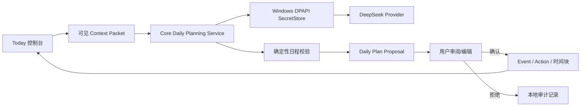

# v0.3 Daily AI Control Loop 规格

| 字段 | 内容 |
| --- | --- |
| 状态 | Proposed — 已确认产品方向，待规格评审后实施 |
| 日期 | 2026-08-17 |
| 上游 | [PRD](../../product/PRD.md)、[MVP 范围](../../product/MVP-SCOPE.md)、[当前 MVP 技术设计](../../technical/IMPLEMENTED-MVP-DESIGN.md) |
| 版本目标 | 从“本地模块基础”升级为可见、可确认的真实 AI 每日排程闭环 |

## 1. 目标与成功体验

v0.3 只解决一件最重要的事情：用户配置 DeepSeek 后，打开首页即可让系统基于当天已有的日程、具体任务和恢复状态提出一份**可解释、可编辑、待确认**的今日计划；确认后，时间轴与各模块任务同步更新。

成功不等于“模型说了一段话”。成功的完整路径为：

```text
安全配置 DeepSeek → 连接测试成功
  → 首页请求/07:00 触发每日计划
  → 系统展示来源、冲突与取舍
  → 用户编辑、接受或拒绝建议
  → 已接受时间块与 Action 回到 Today 时间轴
```

验收时，用户能在桌面或 iPhone 浏览器完成这条路径；首页首屏始终能看到时间轴和行动，不以聊天窗口替代日程。

## 2. 已采纳的假设

1. 本期是单 Owner、本地 Windows 主机运行的 Web Dashboard；iPhone 通过浏览器访问同一实例。
2. 首个真实云模型 Provider 是用户自备的 DeepSeek API；本地 Codex、课表 OCR、公开检索、动作 RAG 与营养 Provider 不进入 v0.3。
3. API 密钥不能进入 Git、`.env`、浏览器 LocalStorage、日志或 Agent Memory；Windows 以 DPAPI 保护的本地密文保存为首个实现。
4. DeepSeek 只得到本次“今日排程”所需的最小 context packet；健康自由文本默认不发送，除非用户在调用前显式选择“完整健康上下文”。
5. Agent 只能创建结构化建议和 Proposal；只有用户确认才会写入 Event、时间块或 Task 状态。
6. 每日 07:00 由 Core 内部调度；若机器错过该时刻，则当天首次打开 Today 时补做一次，不重复覆盖已确认计划。

## 3. 用户可见范围

### 3.1 首页重构

`/today` 改为“日程优先”的 Daily Control Console：

- 顶部显示日期、恢复摘要、今日可用时间与最近一次计划状态；
- 主区显示固定 Event 与已确认软时间块组成的时间轴；
- 旁区显示按时间/优先级排序的具体 Action，标明来源模块；
- “生成/更新今日计划”是明确入口，不伪装成常驻聊天；
- 有计划草案时显示变更数量、冲突、依据和“查看并确认”入口；
- 点击 Action、Event 和 Proposal 继续进入相应详情/处理页。

空状态必须解释下一步：尚无 Event/任务时提示用户先建立日程或 Action；Provider 未连接时显示设置入口，不能展示虚构建议。

### 3.2 Provider 设置与连接测试

`/settings/providers` 提供 DeepSeek 设置流程：

1. 输入 API Key；前端只将其通过已认证本机请求交给 Core，不保存到浏览器；
2. Core 通过 `SecretStore` 使用 Windows DPAPI 保存密文，并只保存 Provider 名称、状态和最近测试时间等非敏感元数据到 SQLite；
3. 用户主动点击“测试连接”时，Core 发出最小的模型请求；
4. 界面明确展示 Ready、未配置、认证失败、限额/网络失败或模型响应无效；错误不得泄露 Key。

删除/替换密钥是破坏性操作，必须显示当前 Provider 与影响并要求二次确认。

### 3.3 每日计划 Agent

每日计划由单一“日程协调 Agent”完成。其输入只包括：

- 当天固定 Event 与已确认软时间块；
- 未完成 Action 的标题、领域、截止日期、预计时长、优先级和当前状态；
- 已确认的恢复等级/约束（默认仅枚举等级，不含原始健康文本）；
- 用户明确保存的日程偏好与可用时间；
- 用户本次在界面确认可外发的 context packet 摘要。

模型必须返回受 Zod 契约约束的 JSON：简短摘要、每项建议的 Action/时段/时长/理由、冲突或不能安排的事项。Core 再用确定性规则校验时间范围、重叠、硬 Event、最大负荷和实体归属。任何无效模型输出都只形成失败 Run，不产生写入。

### 3.4 Proposal 审阅与确认

计划草案页面/抽屉逐项显示：原有安排、建议变化、引用的本地事实、冲突和取舍。

用户可以：

- 修改建议开始/结束时间、删除一项或降低优先级；
- 一次性确认全部有效项，或只确认选中项；
- 拒绝并可附带短理由；
- 保留为“稍后处理”。

确认采用乐观版本校验。若基础日程在生成后变更，系统拒绝旧草案并提示重新生成；绝不静默覆盖。

## 4. 系统与数据设计



新增或扩展的本地对象：

| 对象 | 用途 | 敏感性 |
| --- | --- | --- |
| `provider_credentials` | Provider Key 的 DPAPI 密文与版本；绝不返回给 Web | 高 |
| `provider_connection_tests` | 非敏感状态、时间、错误分类 | 低 |
| `daily_plan_runs` | 触发方式、Context Manifest、模型/校验状态、摘要 | 中 |
| `daily_plan_proposals` | 草案项、基础版本、理由、确认/拒绝状态 | 中 |
| `proposal_decisions` | 用户编辑、接受/拒绝和时间 | 中 |

所有迁移均为加法迁移，保留现有 Owner、Task、Event、Memory 和 Agent 数据。

## 5. API 与模块边界

| 边界 | 责任 |
| --- | --- |
| `SecretStorePort` | 保存、读取、替换、删除 Provider 密钥；测试可替换为内存实现 |
| `ProviderCredentialService` | 认证、Key 生命周期、连接测试、错误分类；不向 Web 返回密钥 |
| `DailyPlanningContextService` | 从现有本地日程/任务/Signal 构造最小 Context Manifest |
| `DailyPlanningProvider` | DeepSeek OpenAI-compatible HTTP 调用、超时、结构化输出解析；无日程写权限 |
| `DailyPlanService` | 创建 Run、确定性校验、保存 Proposal、版本冲突处理 |
| `ProposalApplyService` | 在用户确认后原子写入已选 Event/Action/时间块 |
| Web | 显示 Context 摘要、状态、草案和确认操作；不直接访问密钥或模型端点 |

初期 HTTP 路由按下列语义设计，具体路径在 Contracts 先冻结：

- `GET/PUT/DELETE /v1/providers/deepseek/credential`
- `POST /v1/providers/deepseek/connection-test`
- `GET /v1/daily-plans/today`
- `POST /v1/daily-plans/generate`
- `PATCH /v1/daily-plans/:id/items/:itemId`
- `POST /v1/daily-plans/:id/apply`
- `POST /v1/daily-plans/:id/reject`

## 6. 安全、隐私和失败策略

- Provider HTTP 请求设超时、最大重试次数、响应大小和每日调用额度；错误归类但不写入请求正文、密钥或健康原文。
- Key 在发送到 Core 后不能再从 API 读取；页面只展示“已配置/最后四位（可选）/最近测试状态”。
- 每个 Run 持久化可读的 Context Manifest：字段类别、实体数量、是否含健康摘要、目的和发送时间；不把 API Key 写入其中。
- DeepSeek 网络失败、认证失败、限额、无效 JSON 或校验失败都保持原日程不变，并给出可重试提示。
- v0.3 不运行未确认的日程写入、不启动自主多 Agent Loop、不访问项目文件或外部网页。

## 7. 测试与验收

必须覆盖：

1. 密钥不出现在 API 响应、SQLite 明文、日志断言或 Context Manifest；替换/删除必须需要 Owner 认证。
2. 未配置 Provider、连接失败和错误模型输出都不创建成功 Proposal、不改变日程。
3. 受控假 Provider 可产生一个合法计划，确定性校验能拒绝硬 Event 冲突和过期基础版本。
4. 用户只确认部分项目时，只写入所选时间块和 Action；拒绝不会写日程。
5. 1440×900、390×844 和 320×800 下，首页可见时间轴、Action、生成入口和 Proposal 审阅；无横向滚动、键盘可达。
6. 真实 DeepSeek 验收仅由用户提供 Key 后手工执行一次；自动化测试一律使用假 Provider，不能依赖真实额度。

质量门：`npm test`、`npm run typecheck`、`npm run lint`、`npm run build`、`npm run test:e2e`、`git diff --check` 全部通过；发现的 P0/P1 写入缺陷记录再修复。

## 8. 明确延期

- 本地 Codex Project Agent 的真实项目扫描与每日工作 Brief；
- 课表截图 OCR、课程公开检索和学习 Agent；
- 动作数据库/RAG、训练 Session Proposal、自然语言食物解析；
- 多 Agent 自动协商、长期记忆压缩、云同步、Docker、iPhone 原生 App、穿戴设备与日历集成。

这些不是遗漏，而是为了让第一条真实 AI 闭环可控、可验收且在视觉上明显区别于上一版。
