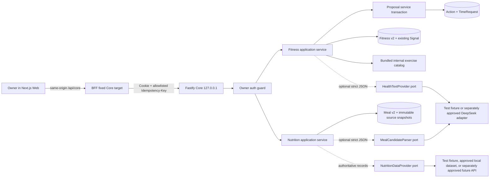
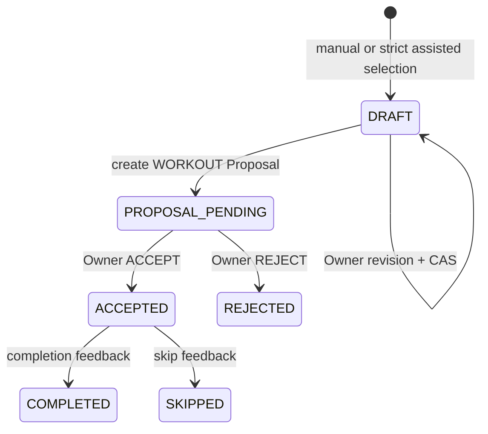
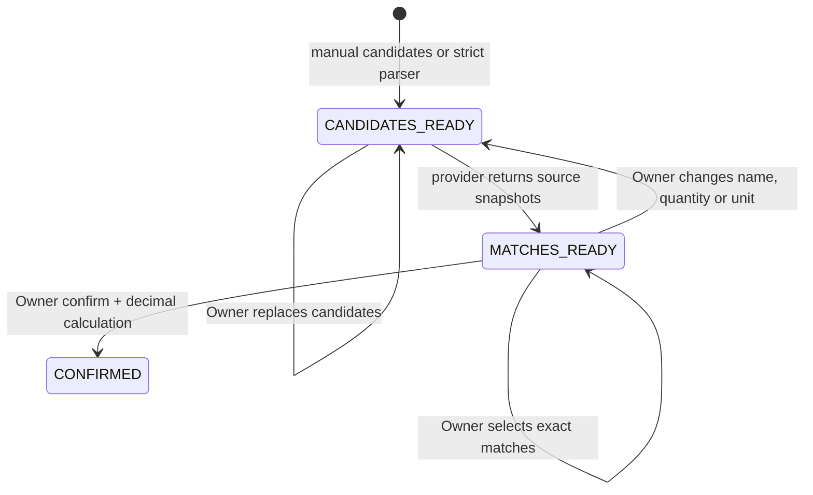

# EV AI Dashboard v0.7 Fitness and Nutrition Execution Design

**Status:** Frozen execution design

**Version:** `0.7.0`

**Date:** 2026-08-31

**BASE:** `37982d8ddaee9eeaf1c0c7b0dc729ad03e7b2285` (`37982d8`)

**Authority:** `docs/superpowers/specs/2026-08-23-v0.4-v0.9-mvp-design.md`, product PRD/MVP scope, this execution design, then the paired implementation plan
**Execution:** one continuous `gpt-5.6-terra`, `xhigh` reasoning and priority, after the main Agent reviews this design and plan

## 1. Executive recommendation

Ship v0.7 as two new, review-first v2 aggregates beside the v0.3 compatibility surfaces:

1. `FitnessCheckIn → deterministic Signal/safety decision → Workout revision → WORKOUT Proposal → Owner decision → FITNESS Action + ACTIVE TimeRequest → completion feedback`.
2. `Meal text/manual candidates → candidate revision → authoritative provider matches → Owner-selected match revision → decimal-safe Core calculation → Owner confirmation → Meal v2`.

The version is useful without pretending that external data exists. A tiny bundled exercise catalog is explicitly `FIRST_PARTY_INTERNAL`, project-internal, non-medical and `redistribution=false`. Production has no configured workout-text, meal-parser or nutrition-data adapter by default. Manual workout construction and manual meal-candidate editing remain available; authoritative meal confirmation fails closed until a nutrition-data adapter is separately approved and configured. Automated tests use visibly synthetic `TEST_FIXTURE` adapters and can prove the engineering loop, but cannot prove a real nutrition source.

This design does not diagnose, treat, prescribe, infer disease, auto-write an Action/TimeRequest/Meal, let a model invent nutrient values, or transmit real health data. A reported pain or acute-risk flag always blocks workout creation and returns only “stop exercise and seek professional help.”

## 2. Version goal, non-goals and release meaning

### 2.1 Goals

- Capture a bounded local check-in and create one deterministic `RECOVERY` Signal with explicit lineage.
- Produce a versioned Workout draft from reviewed internal-catalog citations, with an always-available manual path and an optional bounded text-selection port.
- Materialize a Workout only through the existing Proposal decision transaction, creating exactly one `FITNESS` Action and one `FITNESS_AGENT` TimeRequest.
- Record Owner completion or skip feedback with optimistic concurrency and immutable audit lineage.
- Turn natural-language meal text into food/serving candidates through a strict parser port; never accept nutrient values from that parser.
- Match candidates to strict nutrition-data records, preserve source/version/dataset hash/record hash/serving units, calculate with integer decimal math, and write a Meal only after Owner confirmation.
- Expose honest capability states and evidence labels, including unconfigured production and `TEST_FIXTURE` automation.
- Advance all package and runtime version facts consistently to `0.7.0` without rewriting historical rows.

### 2.2 Non-goals

- Diagnosis, treatment, rehabilitation plans, medical thresholds, medication advice, calorie targets, weight-loss prescriptions or emergency triage beyond the fixed stop/help message.
- Automatic acceptance of any Workout Proposal, automatic Action/TimeRequest creation, or automatic Meal confirmation.
- A GitHub exercise database, an implied open-source license, external exercise downloads, USDA values, another nutrition dataset, or a real API call.
- Model-generated nutrient values, unit conversion guesses, density guesses, serving-size guesses or “typical value” fallbacks.
- Sending check-in rows, Signals, meal history, Owner IDs, local dates, pain/acute flags or free-form health history to a Provider.
- Installing a package, using a real credential, incurring cost, deploying, pushing, tagging or releasing.
- Repairing the six accepted v0.6 P2 findings.

### 2.3 What `PASS` means

An engineering PASS means contracts, deterministic policy, additive migration, fail-closed composition, synthetic `TEST_FIXTURE` adapters, responsive Web behavior and the complete local confirmation paths pass with P0=0 and P1=0. It does not mean a real exercise supplier, DeepSeek health-text call, nutrition dataset or nutrition API was exercised.

The real nutrition chain and every real Provider call are recorded exactly as:

> **NOT RUN — APPROVAL REQUIRED**

## 3. Evidence at BASE and gap map

The starting worktree is clean at `37982d8`. Repository inspection found no repository-level `LICENSE`/`COPYING` file and no exercise, workout, USDA, food-data or nutrition-data catalog. No network lookup was used.

| Existing v0.3/v0.6 surface | BASE behavior | v0.7 decision | Compatibility consequence |
| --- | --- | --- | --- |
| `POST /v1/check-ins`; `checkInSchema` | Accepts `sleepHours`, `energy`, `discomfort`; writes only a `Signal` and returns deterministic recovery | **Preserve** unchanged as a legacy compatibility endpoint. Add `/v1/fitness/*` v2 APIs and a persisted `FitnessCheckIn` with safety lineage | Existing tests/clients continue to work; v0.7 Web stops using the legacy route |
| `signals` v3 table | Has Owner/date/kind/value/source/version but no check-in foreign key | **Preserve** table/fields. v20 `fitness_check_ins_v2.signal_id` links the new check-in to the existing Signal | No old Signal rewrite or backfill |
| `POST /v1/meals`; `createMealSchema` | Owner supplies floating numeric nutrients and Core writes `meal_records` | **Preserve** endpoint/table for compatibility; mark contract/API documentation as legacy Owner-confirmed unsourced input. v0.7 Web does not call it | No old row reinterpretation; no historical float conversion |
| `meal_records` v8 | `REAL` totals and `entries_json`; no source, revision or version | **Preserve** exactly. Add `meal_drafts_v2`, immutable revisions/snapshots, `meals_v2` and text decimals | v2 list endpoints return only v2 meals; legacy records remain queryable only through legacy code |
| Proposal kinds/sources | `WORKOUT`, `NUTRITION`, `FITNESS_AGENT`, `NUTRITION_AGENT` exist, but changes/applier support only schedule and learning | **Extend** `proposalChangeSchema` with `CREATE_WORKOUT_ACTION`; extend type-specific applier dispatch | `NUTRITION` Proposal stays reserved; meal confirmation is its own Owner command |
| Proposal decision/idempotency/audit | Transactional decision, CAS, stable replay and immutable `proposal_audits` already exist | **Reuse** unchanged endpoint and decision record. Add Workout applier inside the same transaction | No second accept endpoint and no duplicate Action/TimeRequest path |
| `actions`, `activity_sessions` | Already support `FITNESS` Action and `WORKOUT` session | **Reuse** for accepted workouts and completed feedback | No enum/table rebuild |
| `time_requests` v17 | Supports `FITNESS_AGENT`, `origin=ACTION`, ACTIVE/CLOSED and CAS | **Reuse** exact semantics. Accepted Workout creates ACTIVE request with Action origin | Existing Daily Plan consumes it without a v0.7 planner refactor |
| `providers.ts` v0.6 capability matrix | Exact three learning capabilities and `NONE/TEST_FAKE/PRODUCTION_ADAPTER` | **Preserve** exact matrix. Add separate v0.7 health-capability contracts/table/endpoint | Avoids breaking the fixed v0.6 array and v19 SQL `CHECK` values |
| v18 idempotency table | SQL `CHECK` admits only three planning/proposal operations | **Preserve**. Add `v07_idempotency_records` with v0.7 operation values | No destructive table rebuild |
| v19 capability/audit tables | SQL `CHECK` values are v0.6-only | **Preserve**. Add `v07_capability_runs` and `v07_audit_events` | No false reuse of learning evidence categories |
| Fitness/Nutrition Web workspaces | One check-in form and one direct numeric meal form | **Replace UI usage**, not APIs: fitness review/proposal/feedback and meal candidate/match/confirm workspaces | Legacy routes remain but are no longer the primary UI |

“Deprecated” in v0.7 is advisory only: `POST /v1/meals`, `createMealSchema`, `mealRecordSchema` and `meal_records` receive a `@deprecated Legacy owner-confirmed unsourced numeric input` comment, but are not removed, disabled, renamed or altered. The legacy check-in endpoint is retained without a deprecation promise because it still provides the simple Signal behavior.

## 4. Architecture and trust boundaries



### 4.1 Data and permission boundary

| Data | Local persistence | May enter a test fixture | May enter a real external adapter in this version | Notes |
| --- | --- | --- | --- | --- |
| Owner ID/session | SQLite/auth only | No | No | Ports never receive Owner identity |
| Check-in `localDate`, `sleepMinutes`, `energyLevel`, `discomfortLevel`, `hasPain`, `acuteRisk` | Yes, Owner-scoped SQLite | Synthetic values only | No | No diagnosis, symptom narrative, medication or vital fields exist |
| Deterministic Signal/recovery/safety reasons | Yes | Synthetic constraints only | No | Real outbound default is zero fields |
| Workout goal/equipment/duration and internal catalog citations | Yes | Yes | Only after separate Provider/data/cost approval | Provider receives no raw check-in or pain reason |
| Meal text | Yes, local draft only | Synthetic string | No in the authorized v0.7 run | A future approved parser may receive only this field after disclosure; no date/history/Owner ID |
| Parsed food/serving candidates | Yes | Yes | A future approved nutrition adapter may receive query, quantity and unit only | Parser cannot supply nutrients |
| Nutrition source records and final Meal | Yes | Synthetic records clearly labelled | No real call/data in the authorized run | Source/version/hash and exact serving basis are mandatory |
| Provider prompt/completion bodies | No | No durable body | No durable body | Runs store counts, hashes, descriptor and terminal code only |

Production composition sends **zero real health context** because all three v0.7 Provider ports default to unavailable. Owner-facing disclosure is necessary for a future call but is not sufficient to authorize repository-level wiring; supplier, data fields, license, credential, cost and one controlled call also need explicit user approval.

### 4.2 Security properties

- All entity lookup starts with `owner_id`; cross-Owner IDs return the same `404` as missing IDs.
- Provider inputs are plain strict JSON values. No Provider can request tools, shell, filesystem, SQL, network targets, redirects or follow-up calls.
- Catalog and provider text are untrusted data. They can populate bounded display fields only after Zod validation and deterministic post-policy checks.
- Provider calls happen outside SQLite write transactions. Claim and terminalization are separate short transactions.
- Core remains loopback-only; BFF target is fixed; v0.7 adds no upload, arbitrary URL, Cookie forwarding or Authorization forwarding.
- Logs/audits contain IDs, hashes, descriptor/evidence kinds, counts and error codes, never meal text, check-in values, catalog text, Provider bodies or secrets.

## 5. Frozen domain contracts

### 5.1 Shared primitives

```ts
type Sha256 = string; // lowercase /^[a-f0-9]{64}$/
type CanonicalDecimal = string; // /^(0|[1-9][0-9]{0,5})(\.[0-9]{1,6})?$/

interface Pagination {
  page: number;      // integer >= 1
  pageSize: number;  // integer 1..50, exercise retrieval 1..5
  total: number;     // integer >= 0
  totalPages: number;
}

interface LineageRef {
  entityType:
    | 'FITNESS_CHECK_IN'
    | 'SIGNAL'
    | 'WORKOUT'
    | 'WORKOUT_REVISION'
    | 'PROPOSAL'
    | 'ACTION'
    | 'TIME_REQUEST'
    | 'MEAL_DRAFT'
    | 'MEAL_REVISION'
    | 'FOOD_SNAPSHOT'
    | 'MEAL';
  entityId: string;
  entityVersion: number;
  contentHash: Sha256 | null;
}
```

Canonical JSON recursively sorts object keys, preserves array order, uses UTF-8 and rejects non-finite numbers. Every content hash is `sha256(canonicalJson(value))`.

### 5.2 Fitness check-in and medical safety

```ts
interface CreateFitnessCheckInInput {
  localDate: string;
  sleepMinutes: number;       // integer 0..1440
  energyLevel: 1 | 2 | 3 | 4 | 5;
  discomfortLevel: 0 | 1 | 2 | 3 | 4 | 5;
  hasPain: boolean;
  acuteRisk: boolean;
}

type WorkoutSafetyDecision =
  | {
      eligibility: 'BLOCKED';
      notice: 'STOP_EXERCISE_AND_SEEK_PROFESSIONAL_HELP';
      reasonCodes: Array<'SELF_REPORTED_PAIN' | 'SELF_REPORTED_ACUTE_RISK'>;
      maxDurationMinutes: 0;
      intensityCap: 'NONE';
    }
  | {
      eligibility: 'ELIGIBLE';
      notice: 'NON_MEDICAL_RECOVERY_GUIDANCE';
      reasonCodes: Array<'RECOVERY_READY' | 'RECOVERY_MODERATE' | 'RECOVERY_CAUTION'>;
      maxDurationMinutes: 60 | 45 | 30;
      intensityCap: 'MODERATE' | 'LOW';
    };

interface FitnessCheckIn {
  id: string;
  localDate: string;
  sleepMinutes: number;
  energyLevel: 1 | 2 | 3 | 4 | 5;
  discomfortLevel: 0 | 1 | 2 | 3 | 4 | 5;
  hasPain: boolean;
  acuteRisk: boolean;
  signalId: string;
  recovery: { score: number; level: 'READY' | 'MODERATE' | 'CAUTION'; reasonCodes: string[] };
  safety: WorkoutSafetyDecision;
  policyVersion: 'WORKOUT_SAFETY_V1';
  version: 1;
  createdAt: string;
}
```

`deriveWorkoutSafetyV1()` is deterministic:

```ts
if (input.hasPain || input.acuteRisk) {
  const reasonCodes: Array<'SELF_REPORTED_PAIN' | 'SELF_REPORTED_ACUTE_RISK'> = [];
  if (input.hasPain) reasonCodes.push('SELF_REPORTED_PAIN');
  if (input.acuteRisk) reasonCodes.push('SELF_REPORTED_ACUTE_RISK');
  return {
    eligibility: 'BLOCKED',
    notice: 'STOP_EXERCISE_AND_SEEK_PROFESSIONAL_HELP',
    reasonCodes,
    maxDurationMinutes: 0,
    intensityCap: 'NONE',
  };
}

const recovery = calculateRecovery({
  sleepHours: input.sleepMinutes / 60,
  energy: input.energyLevel,
  discomfort: input.discomfortLevel,
});
const eligible = (
  intensityCap: 'LOW' | 'MODERATE',
  maxDurationMinutes: 30 | 45 | 60,
  reasonCode: 'RECOVERY_READY' | 'RECOVERY_MODERATE' | 'RECOVERY_CAUTION',
): WorkoutSafetyDecision => ({
  eligibility: 'ELIGIBLE',
  notice: 'NON_MEDICAL_RECOVERY_GUIDANCE',
  reasonCodes: [reasonCode],
  maxDurationMinutes,
  intensityCap,
});
if (recovery.level === 'CAUTION') return eligible('LOW', 30, 'RECOVERY_CAUTION');
if (recovery.level === 'MODERATE') return eligible('LOW', 45, 'RECOVERY_MODERATE');
return eligible('MODERATE', 60, 'RECOVERY_READY');
```

Pain and acute-risk branches do not call recovery text generation, catalog retrieval or a Provider. They persist only the Owner-reported booleans, return the fixed notice, and forbid Workout creation with `422 WORKOUT_BLOCKED_BY_SAFETY`.

### 5.3 Exercise source and stable citations

```ts
interface ExerciseCatalogManifest {
  schemaVersion: 'EXERCISE_CATALOG_V1';
  catalogId: 'ev-ai-internal-starter';
  catalogVersion: '2026.08.31.1';
  source: {
    kind: 'FIRST_PARTY_INTERNAL';
    name: 'EV AI internal starter catalog';
    licenseId: null;
    redistribution: false;
    medicalClaims: false;
  };
  contentSha256: Sha256;
  itemCount: 8;
}

interface ExerciseCitation {
  citationId: string;
  catalogId: 'ev-ai-internal-starter';
  catalogVersion: '2026.08.31.1';
  catalogHash: Sha256;
  exerciseId: string;
  itemHash: Sha256;
  sourceKind: 'FIRST_PARTY_INTERNAL';
  redistribution: false;
}
```

The eight project-authored, non-medical starter records are: `chair-sit-to-stand`, `wall-push-up`, `hip-hinge-practice`, `glute-bridge`, `bird-dog`, `dead-bug`, `standing-calf-raise` and `easy-walk`. Each record contains only a neutral name, short technique text, movement tags, equipment tags, impact level and deterministic starter parameters. It contains no diagnosis, treatment, injury claim, contraindication list or copied external prose.

`citationId = sha256(catalogId + "\n" + catalogVersion + "\n" + contentSha256 + "\n" + exerciseId + "\n" + itemHash)`. A Workout revision stores the full citation object, so a future catalog update cannot silently change an accepted plan.

Retrieval is bounded and deterministic. It filters by `intensityCap`, available equipment and excluded impact tags; scores `goal match × 4 + movement match × 2 + equipment match × 2 + low-impact match × 1`; sorts by score descending then `exerciseId` ascending; returns at most five. `BLOCKED` safety returns zero results. Catalog text never controls a path, query, tool or side effect.

### 5.4 Workout aggregate and states

```ts
type WorkoutState =
  | { state: 'DRAFT'; proposalId: null; actionId: null; timeRequestId: null; feedbackId: null }
  | { state: 'PROPOSAL_PENDING'; proposalId: string; actionId: null; timeRequestId: null; feedbackId: null }
  | { state: 'ACCEPTED'; proposalId: string; actionId: string; timeRequestId: string; feedbackId: null }
  | { state: 'REJECTED'; proposalId: string; actionId: null; timeRequestId: null; feedbackId: null }
  | { state: 'COMPLETED'; proposalId: string; actionId: string; timeRequestId: string; feedbackId: string }
  | { state: 'SKIPPED'; proposalId: string; actionId: string; timeRequestId: string; feedbackId: string };

interface WorkoutRevision {
  id: string;
  workoutId: string;
  parentRevisionId: string | null;
  revisionNo: number;
  title: string;
  rationale: string;
  items: Array<{
    citation: ExerciseCitation;
    rounds: number;           // integer 1..5
    reps: number | null;      // integer 1..50
    durationSeconds: number | null; // integer 30..1800
    restSeconds: number;      // integer 0..600
  }>;
  scheduling: {
    targetDate: string;
    durationMinutes: number;  // integer 5..120 and <= safety.maxDurationMinutes
    priority: 'LOW' | 'MEDIUM' | 'HIGH';
    earliestStartLocalTime: string | null;
    latestEndLocalTime: string | null;
  };
  provenance: Array<{
    kind: 'RULES' | 'OWNER_EDIT' | 'MODEL_SELECTION';
    capabilityRunId: string | null;
    editedFields: string[];
    capturedAt: string;
  }>;
  contentHash: Sha256;
  createdAt: string;
}

type Workout = WorkoutState & {
  id: string;
  checkInId: string;
  signalId: string;
  currentRevisionId: string;
  generationMode: 'MANUAL' | 'ASSISTED';
  version: number;
  createdAt: string;
  updatedAt: string;
};
```



No transition bypasses CAS. A `DRAFT` with a stale catalog citation, a duration above the check-in cap, a blocked check-in, duplicate item, invalid time window or changed current revision cannot create a Proposal.

The new Proposal change is exactly one `CREATE_WORKOUT_ACTION`:

```ts
interface CreateWorkoutActionChange {
  operation: 'CREATE_WORKOUT_ACTION';
  workout: {
    workoutId: string;
    revisionId: string;
    expectedWorkoutVersion: number;
    contentHash: Sha256;
  };
  action: {
    id: string;
    title: string;
    targetDate: string;
    status: 'OPEN';
    kind: 'FITNESS';
    version: 1;
    createdAt: string;
    updatedAt: string;
  };
  scheduling: {
    timeRequestId: string;
    durationMinutes: number;
    priority: 'LOW' | 'MEDIUM' | 'HIGH';
    earliestStartLocalTime: string | null;
    latestEndLocalTime: string | null;
    isFixed: false;
  };
  citationIds: string[];
}
```

Acceptance atomically validates Owner/workout/current revision/hash/version/state and inserts `actions(kind='FITNESS')`, `workout_actions_v2`, and `time_requests(source='FITNESS_AGENT', origin_kind='ACTION', origin_id=action.id, origin_version=1, lifecycle_status='ACTIVE')`, then moves the Workout to `ACCEPTED`. Rejection creates no Action/TimeRequest and moves it to `REJECTED`.

Completed feedback requires `startedAt < endedAt` and a duration no longer than 24 hours; it writes one `activity_sessions(kind='WORKOUT')`, marks the Action `DONE`, closes an ACTIVE request as `COMPLETED`, and moves the Workout to `COMPLETED`. Skip feedback writes no ActivitySession, marks the Action `CANCELLED`, closes an ACTIVE request as `CANCELLED`, and moves the Workout to `SKIPPED`. If Daily Plan already closed the request, feedback leaves its existing closed fact unchanged. `hadPain=true` stores only the boolean and returns the same stop/help notice; it never creates a diagnosis or a follow-up plan.

### 5.5 Nutrition candidates, source records and Meal

```ts
type ServingUnit = 'GRAM' | 'MILLILITER' | 'ITEM';

interface MealCandidate {
  candidateId: string;
  displayName: string;
  quantityDecimal: CanonicalDecimal;
  unit: ServingUnit;
  included: boolean;
  selectedFoodSnapshotId: string | null;
  provenance: Array<{
    kind: 'MODEL_PARSE' | 'OWNER_EDIT' | 'DATA_MATCH';
    capabilityRunId: string | null;
    editedFields: string[];
    capturedAt: string;
  }>;
}

interface NutritionSourceDescriptor {
  sourceKind: 'TEST_FIXTURE' | 'APPROVED_LOCAL_DATASET' | 'REMOTE_API';
  sourceId: string;
  sourceVersion: string;
  datasetHash: Sha256;
  redistribution: boolean;
  licenseDecisionId: string | null;
}

interface NutritionFoodRecord {
  schemaVersion: 'NUTRITION_RECORD_V1';
  source: NutritionSourceDescriptor;
  recordId: string;
  recordHash: Sha256;
  displayName: string;
  serving: {
    quantityDecimal: CanonicalDecimal;
    unit: ServingUnit;
  };
  nutrientsPerServing: {
    energyKcalDecimal: CanonicalDecimal;
    proteinGramsDecimal: CanonicalDecimal;
    carbohydrateGramsDecimal: CanonicalDecimal;
    fatGramsDecimal: CanonicalDecimal;
  };
}

type MealDraftState =
  | { state: 'CANDIDATES_READY'; confirmedMealId: null }
  | { state: 'MATCHES_READY'; confirmedMealId: null }
  | { state: 'CONFIRMED'; confirmedMealId: string };

type MealDraft = MealDraftState & {
  id: string;
  localDate: string;
  mode: 'PARSE_TEXT' | 'MANUAL';
  originalText: string | null;
  currentRevisionId: string;
  version: number;
  createdAt: string;
  updatedAt: string;
};

interface MealV2 {
  id: string;
  draftId: string;
  localDate: string;
  entries: Array<{
    candidateId: string;
    foodSnapshotId: string;
    displayName: string;
    quantityDecimal: CanonicalDecimal;
    unit: ServingUnit;
    energyKcalDecimal: CanonicalDecimal;
    proteinGramsDecimal: CanonicalDecimal;
    carbohydrateGramsDecimal: CanonicalDecimal;
    fatGramsDecimal: CanonicalDecimal;
    lineage: LineageRef[];
  }>;
  totals: {
    energyKcalDecimal: CanonicalDecimal;
    proteinGramsDecimal: CanonicalDecimal;
    carbohydrateGramsDecimal: CanonicalDecimal;
    fatGramsDecimal: CanonicalDecimal;
  };
  calculationVersion: 'DECIMAL_MICRO_V1';
  version: 1;
  createdAt: string;
}
```

`NutritionSourceDescriptor` refinement is strict: `TEST_FIXTURE` requires `redistribution=false` and `licenseDecisionId=null`; `APPROVED_LOCAL_DATASET` and `REMOTE_API` require a non-empty `licenseDecisionId` that refers to the separately approved source/license decision. The field records approval lineage; it does not make an unreviewed license valid.



A match may be `MATCHED`, `AMBIGUOUS` or `UNMATCHED`; each candidate has at most five choices. Confirmation requires every included candidate to select exactly one immutable snapshot with the same serving unit. v0.7 performs no `ITEM↔GRAM`, `MILLILITER↔GRAM` or density conversion. Unit mismatch is reviewable but not confirmable.

### 5.6 Decimal-safe Core math

No dependency is installed. Core parses canonical decimal strings into `bigint` micros (`scale = 1_000_000n`). Values with more than six fractional digits, signs, exponents, commas, leading zeroes or non-canonical trailing forms are rejected by Contracts before calculation.

```ts
const SCALE = 1_000_000n;

function scaleNutrient(
  nutrientPerServingMicros: bigint,
  quantityMicros: bigint,
  servingQuantityMicros: bigint,
): bigint {
  if (servingQuantityMicros <= 0n) throw new Error('serving quantity must be positive');
  const numerator = nutrientPerServingMicros * quantityMicros;
  return (numerator + servingQuantityMicros / 2n) / servingQuantityMicros;
}
```

Each entry uses round-half-up once at six decimals. Totals add entry micros exactly and serialize as canonical decimal strings with trailing fractional zeroes removed. JavaScript `number`, SQLite `REAL`, `parseFloat`, locale formatting and model output are forbidden in the authoritative calculation path.

## 6. Provider and catalog ports

### 6.1 Ports

```ts
interface HealthTextProvider {
  readonly descriptor: {
    providerId: 'deepseek' | 'v07-test-fixture';
    providerLabel: string;
    adapterKind: 'TEST_FIXTURE' | 'PRODUCTION_ADAPTER';
    evidenceKind: 'AUTOMATED_TEST_FIXTURE' | 'REAL_PROVIDER';
  };
  selectWorkout(input: WorkoutTextSelectionInput, signal: AbortSignal): Promise<unknown>;
  parseMealCandidates(input: MealCandidateParseInput, signal: AbortSignal): Promise<unknown>;
}

interface WorkoutTextSelectionInput {
  schemaVersion: 'WORKOUT_TEXT_SELECTION_V1';
  goal: 'MOBILITY' | 'STRENGTH' | 'ENDURANCE' | 'RECOVERY';
  maxDurationMinutes: 30 | 45 | 60;
  intensityCap: 'LOW' | 'MODERATE';
  catalog: Array<{
    citationId: string;
    name: string;
    neutralTechniqueText: string;
    tags: string[];
  }>;
}

interface WorkoutTextSelectionOutput {
  schemaVersion: 'WORKOUT_TEXT_SELECTION_V1';
  title: string;
  rationale: string;
  orderedCitationIds: string[];
}

interface MealCandidateParseInput {
  schemaVersion: 'MEAL_CANDIDATE_PARSE_V1';
  mealText: string;
  allowedUnits: ['GRAM', 'MILLILITER', 'ITEM'];
  maxCandidates: 30;
}

interface MealCandidateParseOutput {
  schemaVersion: 'MEAL_CANDIDATE_PARSE_V1';
  candidates: Array<{
    displayName: string;
    quantityDecimal: CanonicalDecimal;
    unit: ServingUnit;
  }>;
}

interface NutritionDataProvider {
  readonly descriptor: NutritionSourceDescriptor & {
    providerLabel: string;
    adapterKind: 'TEST_FIXTURE' | 'APPROVED_LOCAL_DATASET' | 'PRODUCTION_ADAPTER';
    evidenceKind: 'AUTOMATED_TEST_FIXTURE' | 'APPROVED_LOCAL_DATASET' | 'REAL_PROVIDER';
  };
  searchBatch(
    input: {
      schemaVersion: 'NUTRITION_SEARCH_BATCH_V1';
      queries: Array<{ candidateId: string; query: string; unit: ServingUnit; limit: 5 }>;
    },
    signal: AbortSignal,
  ): Promise<unknown>;
}
```

DeepSeek is eligible only for `selectWorkout()` and `parseMealCandidates()`. It cannot return a calorie, macro, nutrient, source record, Action, TimeRequest, Proposal, SQL statement, path, URL or tool instruction. Core rejects extra keys, unknown citation IDs, duplicates, unsafe lengths and more than eight selected workout items or thirty meal candidates.

`NutritionDataProvider` is the only source of nutrition numbers. One batch contains 1–10 distinct candidate IDs; its unknown response is strict-parsed as `{candidateId,records: NutritionFoodRecord[]}[]`, with exactly one group per input candidate and max five records per group. Every descriptor/record hash is verified before persistence.

### 6.2 Capability truth table

| Capability | Production default | Autonomous path | Test evidence | Separately approvable path |
| --- | --- | --- | --- | --- |
| `WORKOUT_TEXT_SELECTION` | `NOT_CONFIGURED`; assisted command returns `503` | Manual catalog selection/revision | Explicit local `TEST_FIXTURE` | Bounded DeepSeek text adapter with zero raw check-in fields |
| `MEAL_CANDIDATE_PARSE` | `NOT_CONFIGURED`; parse command returns `503` | Manual candidate entry/edit | Explicit local `TEST_FIXTURE` | Bounded DeepSeek text adapter receiving only disclosed meal text |
| `NUTRITION_DATA_LOOKUP` | `NOT_CONFIGURED`; match returns `503` | Draft can be prepared but not confirmed | Explicit synthetic `TEST_FIXTURE` | Approved local dataset importer or future strict API adapter |

The app never substitutes a successful sample response for `NOT_CONFIGURED`. `TEST_FIXTURE` composition requires `NODE_ENV=test`, `EV_E2E_V07_HEALTH_TEST_ADAPTERS=1` and a resolved database/data root inside the runner-owned `EV_E2E_RUN_DIR`; otherwise `buildApp()` throws before listening.

### 6.3 Deterministic pre/post policy

`HEALTH_CAPABILITY_POLICY_V1` applies before and after any text adapter:

- one Provider call per claimed run; eight-second deadline;
- complete serialized input at most 24,000 UTF-8 bytes and output at most 12,000 bytes;
- workout catalog at most five records, each technique text at most 600 characters;
- meal text at most 1,000 characters and output at most thirty candidates;
- Owner/local-date quota: five calls per capability; claim reserves before external work;
- no tools, streaming tool calls, URL fetches, file access, shell, system prompt fields or arbitrary follow-up calls;
- output is strict parsed, then correlated to input citations/units, then passed through safety and numeric-source checks;
- any pain/acute block is decided before a Provider call and rechecked before Proposal creation;
- provider invalid/unavailable responses create redacted terminal evidence and return `503`; they create no Proposal, Action, TimeRequest, food snapshot or Meal.

## 7. REST contract

All routes require the existing Owner session. All command routes below require `Idempotency-Key` matching the existing 16–128 character schema. All request and response objects are strict Zod objects. Dates are local ISO dates; instants are ISO UTC datetimes. List order is stable and ends with `id` as the tie-breaker. Existing `GET /v1/proposals` retains its v0.3 raw-array response for compatibility; v0.7 follows the Proposal ID returned by the Workout aggregate, while every new v0.7 list is paginated and filterable.

### 7.1 Fitness routes

| Method and route | Strict request/query | Success | Important failures |
| --- | --- | --- | --- |
| `POST /v1/fitness/check-ins` | body `CreateFitnessCheckInInput`; local rate 30/min | `201 {data:{checkIn,signal}}`; replay same status/body + `Idempotency-Replayed:true` | `400 IDEMPOTENCY_KEY_REQUIRED/INVALID`; `422 VALIDATION_FAILED`; `409 IDEMPOTENCY_KEY_REUSED/IN_PROGRESS` |
| `GET /v1/fitness/check-ins` | `localDate?`, `eligibility?=BLOCKED|ELIGIBLE`, `page=1`, `pageSize=20` max 50 | `200 {data:{items,pagination}}`, order `local_date desc,created_at desc,id` | `422 VALIDATION_FAILED` |
| `GET /v1/fitness/exercises` | required Owner-scoped `checkInId`, `query?` max 120, `goal?`, repeated `equipment?` max 5, `page=1`, `pageSize=5` max 5 | `200 {data:{safety,manifest,items,pagination}}`; eligibility supplies intensity cap, blocked safety returns zero items | `404 FITNESS_CHECK_IN_NOT_FOUND`; `422 VALIDATION_FAILED`; startup fails if manifest hash is invalid |
| `POST /v1/fitness/workouts` | discriminated `mode=MANUAL|ASSISTED`, `checkInId`, `expectedCheckInVersion=1`, goal/equipment/scheduling; MANUAL has 1–5 citation IDs; ASSISTED has `disclosureVersion='HEALTH_DISCLOSURE_V1'` | `201 {data:{workout,revision,disclosure}}` | `404 FITNESS_CHECK_IN_NOT_FOUND`; `409 VERSION_CONFLICT/IDEMPOTENCY_KEY_REUSED`; `422 WORKOUT_BLOCKED_BY_SAFETY/CITATION_INVALID/SCHEDULE_INVALID`; `429`; assisted `503 HEALTH_TEXT_PROVIDER_NOT_CONFIGURED/UNAVAILABLE` |
| `POST /v1/fitness/workouts/:id/revisions` | `{expectedVersion,parentRevisionId,title,rationale,items,scheduling}` | `201 {data:{workout,revision}}` | non-enumerating `404`; `409 VERSION_CONFLICT/REVISION_PARENT_STALE`; `422 WORKOUT_NOT_EDITABLE/CITATION_INVALID/SAFETY_POLICY_VIOLATION` |
| `POST /v1/fitness/workouts/:id/proposal` | `{expectedVersion,revisionId}` | `201 {data:{workout,proposal}}`, Proposal is PENDING | `404`; `409`; `422 WORKOUT_NOT_PROPOSABLE/SAFETY_POLICY_VIOLATION` |
| `GET /v1/fitness/workouts` | `state?`, `localDate?`, `page=1`, `pageSize=20` max 50 | `200 {data:{items,pagination}}`, order `updated_at desc,id` | `422` |
| `GET /v1/fitness/workouts/:id` | path UUID | `200 {data:{workout,checkIn,revision,proposal,action,timeRequest,feedback}}` | `404 WORKOUT_NOT_FOUND` |
| existing `POST /v1/proposals/:id/decision` | `{version,decision=ACCEPT|REJECT}` | `200 {data:proposal}`; Workout applier runs atomically | existing `400/404/409`; `422 PROPOSAL_CANNOT_APPLY` |
| `POST /v1/fitness/workouts/:id/feedback` | discriminated `outcome=COMPLETED|SKIPPED`, `expectedVersion`, `hadPain`, `perceivedEffort`; COMPLETED requires `startedAt`,`endedAt`; SKIPPED requires both null | `201 {data:{workout,feedback,action,activitySession,safetyNotice}}` | `404`; `409`; `422 WORKOUT_NOT_ACCEPTED/FEEDBACK_TIME_INVALID`; `429` |

`POST /v1/fitness/workouts` uses deterministic defaults from the cited catalog. Assisted output can choose/order citations and write bounded title/rationale only; Core still supplies rounds/reps/duration/rest defaults and enforces the check-in cap.

### 7.2 Nutrition routes

| Method and route | Strict request/query | Success | Important failures |
| --- | --- | --- | --- |
| `POST /v1/nutrition/meal-drafts` | `MANUAL {localDate,candidates[1..30]}` or `PARSE_TEXT {localDate,mealText<=1000,disclosureVersion}` | `201 {data:{draft,revision,disclosure}}` | `400` idempotency; `409`; `422`; parser `429/503`; no nutrient values accepted in either input |
| `GET /v1/nutrition/meal-drafts` | `state?`, `localDate?`, `page=1`, `pageSize=20` max 50 | `200 {data:{items,pagination}}`, order `updated_at desc,id` | `422` |
| `GET /v1/nutrition/meal-drafts/:id` | path UUID | `200 {data:{draft,revision,matches,confirmedMeal}}` | `404 MEAL_DRAFT_NOT_FOUND` |
| `POST /v1/nutrition/meal-drafts/:id/revisions` | `{expectedVersion,parentRevisionId,operation:'REPLACE_CANDIDATES'|'SELECT_MATCHES',candidates}` | `201 {data:{draft,revision}}`; replacing value fields resets to `CANDIDATES_READY` | `404`; `409 VERSION_CONFLICT/REVISION_PARENT_STALE`; `422 MATCH_SELECTION_INVALID` |
| `POST /v1/nutrition/meal-drafts/:id/matches` | `{expectedVersion,revisionId}` | `202 {data:{draft,revision,matches,source}}`; per candidate max five | `404`; `409`; `422 MEAL_DRAFT_NOT_MATCHABLE`; `429`; `503 NUTRITION_DATA_PROVIDER_NOT_CONFIGURED/UNAVAILABLE/INVALID_RESPONSE` |
| `POST /v1/nutrition/meal-drafts/:id/confirm` | `{expectedVersion,revisionId}` | `201 {data:{draft,meal}}`; replay returns exact Meal | `404`; `409`; `422 MEAL_MATCH_INCOMPLETE/UNIT_MISMATCH/DECIMAL_OUT_OF_RANGE`; never `503` because confirmation uses persisted snapshots only |
| `GET /v1/nutrition/meals` | `localDate?`, `page=1`, `pageSize=20` max 50 | `200 {data:{items,pagination}}`, order `local_date desc,created_at desc,id` | `422` |
| `GET /v1/nutrition/meals/:id` | path UUID | `200 {data:meal}` | `404 MEAL_NOT_FOUND` |

### 7.3 Capability route

`GET /v1/health-capabilities` returns exactly three v0.7 descriptors in key order: `WORKOUT_TEXT_SELECTION`, `MEAL_CANDIDATE_PARSE`, `NUTRITION_DATA_LOOKUP`. Each contains `availability=READY|NOT_CONFIGURED`, adapter/evidence kind, provider/source label, disclosure version, policy version and `realEvidenceStatus='NOT_RUN_APPROVAL_REQUIRED'|'AVAILABLE'`. Rendering this endpoint performs no credential unprotect, file read, network or Provider call.

### 7.4 Error and concurrency semantics

| Status | Frozen meaning |
| ---: | --- |
| `400` | Required/invalid `Idempotency-Key`; malformed transport only |
| `401` | Existing unauthenticated Owner semantics |
| `404` | Missing or cross-Owner entity; never reveal which case |
| `409` | Stale `expectedVersion`, stale parent revision, illegal current state, same idempotency key with a different semantic hash, or operation still in progress; in-progress includes `Retry-After: 1` |
| `422` | Strict request/domain validation, blocked safety, invalid citation/match/units, incomplete confirmation, or deterministic policy rejection |
| `429` | Route/capability quota; `{error:{code:'RATE_LIMITED',message}}` and `Retry-After` |
| `503` | Required Provider absent, timed out, unavailable or schema-invalid; no sample success and no downstream domain write |

Idempotency scope is `(owner_id,idempotency_key)`. Semantic request hash includes operation, resource ID, authenticated Owner ID and canonical request body; it excludes Cookie and header order. Operations are:

`fitness.check_in.create`, `fitness.workout.create`, `fitness.workout.revise`, `fitness.workout.propose`, `fitness.workout.feedback`, `nutrition.meal_draft.create`, `nutrition.meal_draft.revise`, `nutrition.meal_draft.match`, `nutrition.meal.confirm`.

Every mutable aggregate transition uses an explicit statement such as `update workouts_v2 set state=?, version=version+1, updated_at=? where owner_id=? and id=? and version=? and state=?`; zero changed rows returns a current Owner-scoped snapshot in `409 VERSION_CONFLICT` details. Revisions, source snapshots, feedback and audit events are immutable.

## 8. Additive migration v20

There is one migration, version `20`, named `add_v07_fitness_nutrition_loop`. It may use only `CREATE TABLE`, `CREATE INDEX` and immutable triggers. It must not drop, rename, rebuild, alter or update an existing table, column or row.

| New table | Purpose and required lineage |
| --- | --- |
| `fitness_check_ins_v2` | Owner-scoped raw bounded fields, existing `signal_id`, recovery/safety JSON, fixed policy version, version/timestamps |
| `workouts_v2` | Mutable state/CAS and links to check-in, Signal, current revision, Proposal, Action, TimeRequest and feedback |
| `workout_revisions_v2` | Immutable plan JSON, parent/revision number, catalog version/hash, content hash and creator |
| `workout_revision_citations_v2` | Immutable stable citation IDs/item hashes per revision |
| `workout_actions_v2` | One-to-one Workout↔existing Action lineage |
| `workout_feedback_v2` | Immutable completion/skip, effort, pain boolean and local note; optional ActivitySession link |
| `meal_drafts_v2` | Mutable candidate/match/confirm state, local original text, current revision and confirmed Meal |
| `meal_revisions_v2` | Immutable candidate JSON with parent/revision/content hash/creator |
| `nutrition_source_snapshots_v2` | Immutable descriptor: kind/id/version/dataset hash/redistribution/license decision |
| `nutrition_food_snapshots_v2` | Immutable strict provider record and serving/nutrient decimal text with record hash |
| `meals_v2` | Immutable Owner-confirmed totals as decimal text and calculation version |
| `meal_entries_v2` | Immutable candidate→food snapshot→calculated entry lineage |
| `v07_capability_runs` | New health capability claim/lease/descriptor/evidence/call counts/redacted terminal facts; no raw bodies |
| `v07_idempotency_records` | v0.7 semantic keys, request hashes, leases and stable response snapshots |
| `v07_audit_events` | Immutable redacted state-transition audit |

Foreign keys carry Owner correlation where SQLite permits composite uniqueness; service validation repeats Owner checks before writes. Required unique indexes prevent two feedback rows, two Workout Action links, two Meals per draft, duplicate revision numbers and duplicate Owner idempotency keys.

Upgrade tests start from v1, v2, v16, v17, v18 and v19 fixtures, snapshot all existing Owner/Task/Agent run/Proposal/Signal/meal record IDs, values and counts, apply v20 twice through normal startup, and prove the snapshots are byte-equivalent. Historical `app_version='0.5.0'` and `0.6.0` rows remain unchanged; only new v0.7 rows use `0.7.0`.

## 9. UI behavior

### 9.1 Fitness workspace

- Check-in explains that it is non-medical and stores six bounded fields locally.
- A pain or acute-risk result shows only the stop/help notice; catalog selection and Proposal buttons are absent.
- Eligible results show internal catalog source, version, hash abbreviation, `redistribution=false` and “项目内部非医疗目录.”
- Manual construction is primary when text capability is unavailable. Assisted selection shows disclosure/evidence and never hides that it is text-only.
- Every plan is editable as a new immutable revision. “提交提案” is distinct from the existing Proposal “接受” action.
- After acceptance, Action/TimeRequest IDs and schedule status are visible. Feedback requires explicit completion or skip confirmation.

### 9.2 Nutrition workspace

- The primary form accepts meal text. If parser is unavailable, it shows a manual candidate editor instead of a fabricated parse.
- Candidate rows contain name, decimal quantity and unit only; there are no nutrient inputs.
- Match rows show source kind/id/version/hash, serving basis and up to five choices. Synthetic test evidence is visibly “TEST_FIXTURE — 非真实营养数据.”
- The confirm button is disabled until all included candidates have one same-unit match. The confirmation screen shows exact decimal calculations and source lineage.
- The old direct numeric meal UI is removed from primary navigation but its compatibility endpoint/table remain.

Both workspaces support desktop and 390×844 iPhone touch layout with no horizontal overflow, use semantic labels, preserve keyboard access and display 404/409/422/429/503 states without converting them into success copy.

## 10. File responsibility and dependency map

```text
Contracts v0.7
  -> pure domain safety/catalog/decimal functions
      -> additive v20 + health-loop idempotency/capability repository
          -> fitness catalog/check-in/draft service
              -> Workout Proposal applier + feedback
          -> nutrition parser/data ports + draft/match/confirm service
              -> app composition + test-only fixtures + 0.7.0
                  -> Fitness/Nutrition Web + one desktop/iPhone E2E
                      -> one Sol BASE..TARGET review
```

| File/group | Frozen responsibility |
| --- | --- |
| `packages/contracts/src/fitness.ts` | Fitness entities, discriminated states, commands, responses, pagination/filter schemas |
| `packages/contracts/src/nutrition.ts` | Preserve legacy types; add candidates, revisions, sources, decimals, Meal v2 and commands |
| `packages/contracts/src/health-capabilities.ts` | Three v0.7 capability descriptors/disclosures/evidence contracts plus the provider-neutral `HealthTextProvider` port |
| `packages/contracts/src/proposals.ts` | Add and correlate only `CREATE_WORKOUT_ACTION` |
| `packages/domain/src/fitness.ts` | `deriveWorkoutSafetyV1`, bounded catalog rank and deterministic plan defaults |
| `packages/domain/src/nutrition.ts` | canonical decimal parser/formatter, scale and total functions |
| `apps/core/src/modules/health-loop/*` | v20 idempotency, capability run lifecycle, redacted audit and capability endpoint |
| `apps/core/src/modules/fitness/catalog/*` | Exact internal catalog and manifest with verified hash |
| `apps/core/src/modules/fitness/*` | Owner-scoped repository/service/routes/provider port/Proposal applier |
| `apps/core/src/modules/nutrition/*` | Strict parser/data ports, repository/service/routes and decimal persistence |
| `apps/core/src/app.ts` | Explicit port injection, default unavailable composition and applier wiring |
| `apps/core/e2e/v0.7-health-test-adapters.ts` | Synthetic parser/workout/nutrition records; test gates only |
| `apps/web/src/components/fitness/*` | Check-in, safety, catalog, revision, Proposal and feedback UI |
| `apps/web/src/components/nutrition/*` | Text/manual candidate, match lineage and confirm UI |
| `apps/web/e2e/v0.7-health-loops.spec.ts` | One spec executing both loops at desktop and iPhone size with synthetic evidence labels |

## 11. Decisions and rejected alternatives

| Decision | Reason | Rejected alternative |
| --- | --- | --- |
| Add v2 aggregates beside old tables | Lossless migration and honest provenance | Rebuilding `meal_records` or pretending old floats have sources |
| Project-authored eight-item catalog | Executable offline MVP with known origin | Downloading GitHub content or claiming a license not present in the repository |
| `redistribution=false`, `licenseId=null` | No repository-level license or approved external license exists | Calling internal text open-source/public-domain |
| Separate v0.7 capability/idempotency tables | Existing SQL `CHECK` values are frozen and narrow | Rebuilding v18/v19 tables to widen enums |
| Manual fallback plus unavailable production ports | Honest behavior without external authorization | Fake/sample production responses |
| BigInt micros and decimal text | Exact, dependency-free, auditable nutrition math | JS floating math, SQLite REAL, or a new decimal dependency |
| Direct Owner Meal confirmation | A Meal is a reviewed record, not a scheduling side effect | Misusing `NUTRITION` Proposal merely to write a Meal |
| Generic Proposal for Workout materialization | Existing transaction/idempotency/audit semantics fit Action+TimeRequest | A second fitness-only accept endpoint |
| Any pain flag blocks | Clear non-medical safety behavior | Severity thresholds that resemble diagnosis or treatment |
| No real Provider composition in v0.7 | Real health data/network/key/cost are not authorized | Automatically reusing an existing DeepSeek credential for health data |

## 12. Autonomous scope and approval gates

### 12.1 Terra may execute without another user question

- Local TypeScript/React/Fastify/SQLite implementation described in the paired plan.
- Additive migration v20 and deterministic upgrade tests.
- The eight-item first-party/internal starter catalog and manifest/hash tooling.
- Synthetic test meals/exercises and explicit `TEST_FIXTURE` adapters under runner-owned data.
- Focused tests, typechecks, lint, Web build, one local desktop+iPhone Playwright spec, atomic local commits and a local Sol review.

### 12.2 Terra must stop and request approval before

- Any real API call, DNS/network probe, external dataset download, GitHub catalog fetch or remote importer run.
- Adopting an external license, changing redistribution status, copying external exercise text or importing USDA/other nutrition values.
- Reading, exporting or sending real check-ins, meal text, meal history or other personal/health data.
- Using/unprotecting a real credential for v0.7, incurring cost, installing a dependency, publishing, deploying, pushing, tagging or releasing.
- Adding a supplier-specific production adapter not already approved with exact supplier, fields, license, key, cost and one controlled evidence call.

## 13. v0.6 findings explicitly out of scope

The following six P2 findings remain carried and must not be opportunistically repaired: `P2-LEARNING-ERROR-001`, `P2-AUDIT-001`, `P2-REVISION-001`, `P2-EVIDENCE-001`, `P2-REVISION-ATOMICITY-002`, and `P2-E2E-NAV-001`. v0.7 may reuse surrounding code but cannot broaden a task to close any of them.

## 14. Acceptance criteria

1. Pain or acute-risk input produces a deterministic blocked check-in, no catalog/model call and no Workout/Proposal/Action/TimeRequest.
2. Eligible manual Workout revisions use only verified internal citations; assisted test output is bounded and cannot add catalog IDs or unsafe dosage.
3. Proposal rejection writes no Action/TimeRequest; acceptance and replay leave exactly one of each with complete lineage.
4. Completion feedback is CAS/idempotent, writes at most one ActivitySession and never persists a diagnosis.
5. Meal parser output contains no nutrition fields; extra numeric nutrient fields are rejected.
6. Missing production parser/data ports return `503` and create no fabricated provider records or Meal.
7. Every confirmed Meal derives from selected immutable source snapshots with source/version/dataset hash/record hash/unit/serving metadata.
8. Decimal calculations use BigInt micros and canonical strings; no authoritative float path exists.
9. All new entity reads and mutations are Owner-scoped, cross-Owner IDs are `404`, stale transitions are `409`, domain invalidity is `422`, quotas are `429` and Provider absence/failure is `503`.
10. v20 upgrades v19 losslessly and advances only new code/new rows to `0.7.0`.
11. The one v0.7 Playwright spec completes both loops in desktop and iPhone contexts using explicit synthetic evidence labels.
12. Final Sol review reports P0=0 and P1=0 before PASS and records all real source/Provider items as **NOT RUN — APPROVAL REQUIRED**.
