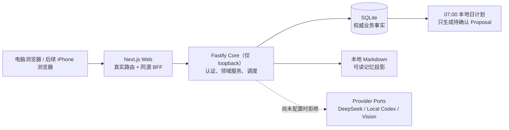

# EV AI Dashboard：本地 MVP 技术设计与实施状态

| 字段 | 内容 |
| --- | --- |
| 版本 | 0.2.0 候选 |
| 状态 | 已实现并进入验收；不是生产发布声明 |
| 日期 | 2026-08-17 |
| 产品依据 | [PRD](../product/PRD.md)、[MVP 范围](../product/MVP-SCOPE.md) |
| 长期蓝图 | [TECH_SPEC](TECH_SPEC.md)、[ARCHITECTURE](ARCHITECTURE.md) |

## 1. 设计结论

本系统不是把 AI 加到普通 Todo List 上，而是一个**以每天为中心的本地个人控制台**：日程、具体行动、恢复状态和待确认建议共同构成今天的可执行视图。系统目前以“本机单 Owner + 浏览器 Web + SQLite”为可信边界；外部模型未配置时必须明确不可用，绝不伪造 AI 分析结果。

技术上采用保守的模块化单体：Web 只负责交互和同源代理，Core 是唯一业务写入者，SQLite 是事实来源。这样既能让以后接入 DeepSeek、受限本地 Codex、视觉识别和 RAG，又不会把供应商协议、API 密钥或业务逻辑散落在页面中。



## 2. 已实现边界

### 2.1 已交付的能力

| 模块 | 当前可用行为 | 数据权威来源 |
| --- | --- | --- |
| 身份 | 首次只允许创建一个 Owner；登录、退出、限流、HttpOnly 会话 | `owners`、`sessions` |
| Today 控制台 | 聚合当天 Event、Action、恢复 Signal、待确认 Proposal；点击进入对应工作区 | 日程/任务/Signal/Proposal 表 |
| 日程与课表 | 建立学期锚点；创建课程导入请求；只有 Provider 可用时才可提取候选并进入确认流程 | `terms`、`courses`、`calendar_rules`、`events` |
| 学习 | 创建课程档案，登记用户给出的课程站点和资料链接 | `courses`、`course_resources` |
| 健身与恢复 | 记录主观睡眠、精力、酸痛等打卡，输出确定性恢复等级与解释 | `signals` |
| 饮食 | 记录用户已经确认的餐食和营养数值；计算并保存当餐合计 | `meal_records` |
| 本地记忆 | 按 GENERAL/FITNESS/LEARNING/PROJECT 分域查看、保存、查看历史、恢复、删除；生成 Markdown 投影 | `memory_documents`、`memory_revisions` + 本地文件 |
| 项目与工作流 | Owner 主动登记本机目录；只读取白名单规划文件并显示过滤快照 | `project_scopes` |
| Agent 框架 | Provider-neutral 能力/会话/Run 契约；没有实际 Provider 时返回明确的阻断状态 | `agent_*`、`agent_runs` |
| 浏览器体验 | `/today`、`/schedule`、`/learning`、`/fitness`、`/nutrition`、`/memory`、`/projects`、`/tasks`、`/agent` 均为真实路由 | Web 仅保留展示状态 |

### 2.2 本轮刻意未实现的能力

以下是产品方向，不是本版本承诺；界面和接口不得假装它们已经工作：

- API 密钥的 OS Credential Store 适配器，以及真实 DeepSeek/本地 Codex 调用；
- 课表截图的视觉识别、课程公开资料搜索与预习讲解；
- 动作数据库/RAG、Workout Proposal、医学诊断或可穿戴设备同步；
- 自然语言食物解析和权威营养 Provider；
- Apple 日历、学校登录、小米手环、Tailscale/公网 HTTPS、Docker、原生 iOS/Android、多 Owner；
- 让 Agent 写入项目、运行 Shell 或修改 Git 仓库。

## 3. 领域模型与日计划

长期模型固定为四类对象：

| 对象 | 作用 | 当前 MVP 状态 |
| --- | --- | --- |
| Event | 某天某时段确定发生的课程、会议或安排 | 已持久化和聚合 |
| Action | 可完成、延期、取消的具体工作/学习/生活事项 | 已持久化；旧 Task 与新的 Action 并存以保持兼容 |
| ActivitySession | 一段训练、预习或深度工作的结构化执行记录 | 表与契约存在，详情工作流后续补足 |
| Signal | 恢复、精力、睡眠、不适等影响安排的状态 | 恢复打卡已写入并显示在 Today |

每日排程遵循固定优先顺序：硬 Event → 已生效的健康限制 → 明确截止日期 → 课程学习 → 训练目标 → 日常习惯。任何 AI 只能提出 `TimeRequest` 或 `Proposal`，不能直接改写日程。用户确认之后，Core 才在事务中落库；冲突则返回 `409`，不会静默覆盖。

日计划 Job 运行在 Core 内，按本地日期去重并执行 07:00 补偿检查。它当前只会基于已存在的本地事实创建/维护日计划候选；完整多 Agent 协商要等各领域 Agent 能真正输出结构化 `TimeRequest` 后启用。

## 4. 模块、接口与安全边界

### 4.1 分层职责

| 层 | 路径 | 只做什么 | 绝不做什么 |
| --- | --- | --- | --- |
| Contracts | `packages/contracts` | Zod 请求/响应 schema、跨层类型 | 保存数据或调用模型 |
| Domain | `packages/domain` | 可重复测试的确定性规则 | 读取 HTTP、SQLite 或浏览器状态 |
| Core | `apps/core` | 身份校验、业务事务、迁移、Provider Port、文件边界 | 向浏览器泄露密钥或允许模型绕过规则 |
| Web | `apps/web` | 真实路由、表单、可访问交互、同源 BFF | 直连 SQLite/Core 端口或持久化业务真相 |

浏览器只访问 Next.js 的 `/api/core/*` 代理；代理固定指向 loopback Core，所有需要的 HTTP 方法（含记忆写入所需的 `PUT`）均被显式转发。Core 默认监听 `127.0.0.1`，未来 iPhone 访问只能暴露 Web 的私有 HTTPS 入口，不能暴露 Core/SQLite。

### 4.2 当前公共接口族

| 接口族 | 已实现端点示例 | 关键规则 |
| --- | --- | --- |
| 日程 | `GET/POST /v1/terms`、`POST /v1/course-imports`、`GET /v1/today` | 导入为候选；确认之前不写日程事实 |
| 学习 | `GET/POST /v1/courses`、`GET/POST /v1/courses/:id/resources` | 只保存 Owner 主动给出的资料引用 |
| 健身 | `POST /v1/check-ins` | 输出恢复建议，不构成医疗判断 |
| 饮食 | `POST /v1/meals` | 仅保存用户确认的数值，不让模型猜测入库 |
| 记忆 | `GET /v1/memory`、`PUT /v1/memory/:scope`、`GET .../revisions`、`POST .../restore`、`DELETE ...` | 版本冲突保留服务端版本，所有操作 Owner 隔离 |
| 项目 | `GET/POST /v1/projects`、`GET /v1/projects/:id/snapshot` | 根目录登记后只返回白名单的过滤快照 |
| Agent/Provider | `GET /v1/providers`、`GET/POST /v1/agent-runs`、`/v1/agent/*` | 未配置 Provider 返回阻断，不写假成功消息 |

所有受保护端点都先验证 Owner 会话，输入/输出穿过共享 schema。冲突使用 `409`，Provider 未配置使用可识别的 `503`/`BLOCKED` 语义，密码、密钥和原始敏感上下文不出现在 API 响应或日志中。

### 4.3 项目 Agent 的只读实现

项目模块遵循 [ADR-010](../decisions/ADR-010-project-analysis-is-snapshot-only-read-only.md)：

1. Owner 显式登记本机目录；服务端解析真实路径并拒绝非目录。
2. Snapshot Builder 只读取固定白名单（例如 PRD、技术文档、任务文档和有限的源码摘要）。
3. `.env*`、密钥/证书、依赖目录、二进制、构建产物和超大内容不会进入快照。
4. UI 不能执行命令、写文件、写 Git 或改变被分析项目。

当前是单 Owner 本机应用，因此 Owner 仍可登记自己有读取权限的任何目录；这是明确的本机信任边界，而不是多用户沙箱。后续远程部署前应把“登记目录”限制为本机 CLI 或受控选择器。

## 5. Hermes 风格本地记忆

SQLite 保存可审计的版本真相，每个 scope 的当前文本再投影为人能直接阅读的 Markdown：

```text
<EV_DATA_DIR>/
  app.sqlite
  memory/
    GENERAL.md
    FITNESS.md
    LEARNING.md
    PROJECT.md
```

用户不需要对每一条自动记录逐项确认，但随时能在“本地记忆”页检查、编辑、查看 revision、恢复或删除。Agent 的长期记忆在未来也必须经同一版本服务写入，不能绕过该入口直接改文件。不同领域只应得到所需最小 scope；项目 Agent 不读取健身/饮食记忆。

每次写入会先在 SQLite transaction 内完成 Markdown 投影；文件系统写入失败会回滚本次 revision，避免出现“界面报错但数据库已前进”的状态。投影的临时文件会在失败后清理。删除是明确的永久删除：当前文档、全部 revisions 和投影一起移除；恢复只适用于删除前仍存在的领域记忆。

## 6. Provider 与多 Agent 演进

Provider Port 是唯一允许接入模型的地方。后续会配置如下职责，而不是让一个通用聊天窗口拥有全部权限：

| Agent | 候选 Provider | 可读输入 | 可产生输出 | 禁止 |
| --- | --- | --- | --- | --- |
| 日程协调 | DeepSeek 文本 | 已确认 Event/Action、最小 Signal、TimeRequest | Schedule Proposal | 直接改日程 |
| 项目 | 受限本地 Codex | 过滤 Project Snapshot、项目记忆 | Project Brief、Action Draft | Shell/Git/文件写入 |
| 学习 | DeepSeek + Public Search | 单课程资料、公开引用 | 学习/预习 Proposal、带引用摘要 | 学校登录、跨课程隐私读取 |
| 健身 | DeepSeek + 动作目录检索 | Fitness scope、check-in、动作资料 | Workout Proposal、Signal 建议 | 诊断、直接排程 |
| 饮食 | DeepSeek + Nutrition Provider | 食物描述、份量、用户目标 | Meal Candidate | 用猜测营养值直接落库 |

每次实际调用需生成 `ContextManifest`，记录输出到哪个 Provider 的最小数据包，并遵循超时、额度、结构化输出校验和失败状态。Provider registry 能同时登记 DeepSeek 与本地 Codex 的 adapter，并按 `ProviderKey` 分派；真正的 API Key 只能由未来的 Windows Credential Store adapter 引用。在该适配器完成前，设置页只显示安全边界和未配置状态，不能收集或明文保存密钥。

## 7. 运行、测试与数据隔离

日常开发由两个本机进程组成：Core 与 Web。数据目录通过 `EV_DATA_DIR` 指定；生产数据、测试数据和验收预览数据必须不同。SQLite 使用 WAL，备份时需同时处理 `app.sqlite`、`-wal` 和 `-shm`。

浏览器 E2E 使用 `scripts/run-e2e.mjs` 启动其自己拥有的 Core/Web 子进程、唯一 `data/e2e-runs/run-*` 数据目录和独立的 Next 构建目录。它会先拒绝被占用的测试端口；Windows 上 Playwright `webServer` 的嵌套 npm 子进程可能残留，因此 runner 在 `finally` 中只终止自己创建的进程树，绝不按端口杀掉用户正在使用的预览服务。它还会复原 Next 自动改写的 `next-env.d.ts`，并在成功时清理唯一测试目录；失败时保留现场用于排查。完整决策见 [ADR-011](../decisions/ADR-011-managed-windows-e2e-runner.md)。

Code Intel lite 在本分支运行完成（工件 `C:\\Users\\asus\\AppData\\Local\\code-intel\\artifacts\\product-prd\\1786914033673-27196-core`）。Sentrux 没有发现循环或 God file，但相对初始基线的耦合指标由 36.09 升至 40.31，质量信号由 9671 降至 9608；基线没有被更新。该结构性 P2 与处理方案记录在[缺陷与边界记录](../reviews/2026-08-17-mvp-bug-log.md)。

## 8. 实施优先级

1. **安全可用的真实 AI**：OS Secret Store、Provider 连接测试、结构化调用审计。
2. **课表和学习闭环**：视觉提取候选 → 用户确认 → 周次/例外日历 → 公开资料与带引用预习。
3. **健身闭环**：动作数据库/RAG、Workout Proposal、恢复约束参与日程协调。
4. **饮食闭环**：自然语言解析候选、可替换营养数据源、确认后的目标差额计算。
5. **远程访问与运维**：私有 HTTPS、备份/恢复、本地日志/健康检查；Docker 和公网部署之后再评估。

任何一项都要先写 ADR/技术规格，再按 Contracts → Core → Web → 独立数据 E2E 的顺序实施。这样项目保持可加模块，但不会通过“AI 能做一切”的提示词把安全和数据一致性问题藏起来。
